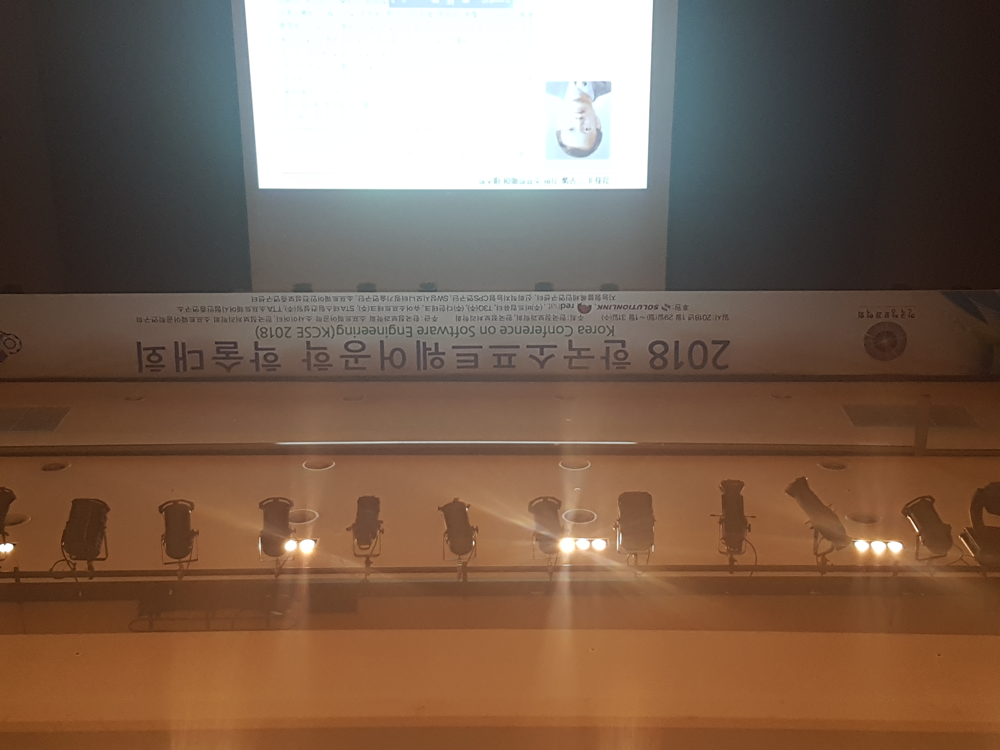
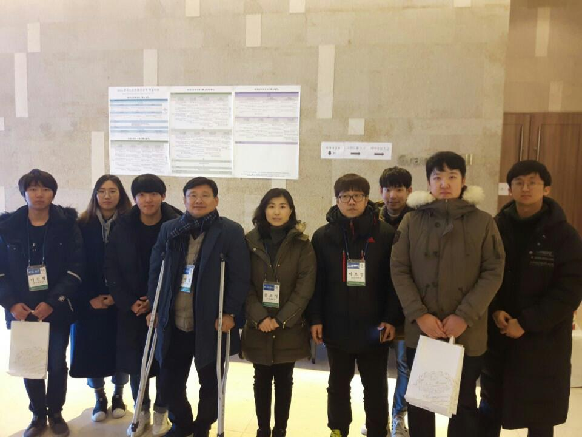

## 2018 한국소프트웨어공학 학술대회 (KCSE 2018)  

▣ 일시: 2018년 1월 29일(월) – 1월 31일(수)  

▣ 장소: 강원도 평창 한화리조트 (휘닉스파크점)  

▣ 주최: 한국정보과학회, 한국정보처리학회  

▣ 주관: 한국정보과학회 소프트웨어공학 소사이어티, 한국정보처리학회 소프트웨어공학연구회  

###### 단체사진

