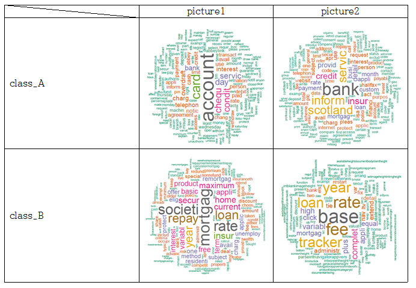

# R 활용한 html 문서 분류 

Web page를 구성하는 html 파일을 여러 기법으로 분류하는 프로젝트를 진행했다. 분류할 Web page 데이터들은 총 11개의 Data Set(데이터셋)으로 구성되어 있다.  

이 데이터셋은  아래처럼 분류가 되어있다.
- (A) Commercial banks Banking and finance  
- (B) Building societies Banking and finance 
- (C) Insurance agencies Banking and finance
- (D) Java Programming languages 
- (E) C/Cpp Programming languages
- (F) Visual Basic Programming languages
- (G) Astronomy Science
- (H) Biology Science
- (I) Soccer Sport 
- (J) Motor sport Sport
- (X) Sport Sport  


html은 Hyper Text Markup Language로 웹 페이지를 위한 마크업 언어이다. HyperText Markup으로 이루어진 html 파일을 어떤 predictor을 사용하여 모델을 만들고 학습을 시킬지 정하기 위해 html 구조를 생각했다. 다음 그림은 html 태그들 사이에서 데이터이다.  

######  html 태그들 사이에서 데이터
  

웹을 구성할 때 내용을 표현하기 위해 자주 사용되는 태그들로 a, b, p, th, td, h1, h2, h3, div, span, li, strong, pre, dd, dt, label 등이 있다. 따라서 페이지에 있는 내용을 모두 추출하기 위해서 자주 쓰이는 태그들 사이의 text 데이터를 추출하였다. 파일마다 어떤 데이터로 이루어져 있는지 알기 위해 추출한 데이터를 통해 문장을 분해, 불필요한 용어와 기호들을 제거하고 숫자들을 제거하여 명사들, 어근들만을 뽑는 정제과정을 거친 후, 빈도수를 세어 가장 많이 나오는 단어들을 순서화 하여 word cloud를 이용해 가시화 하였다. 아래 표에 있는 사진들은 word cloud 결과 화면으로, 각 클래스에 포함되는 파일들의 결과 화면을 무작위로 뽑아 넣은 것이다.  
  
###### 클래스별 word cloud 결과 화면
  
  
  
  
  
  

위와 같이 각 파일들 마다 가장 많이 나오는 단어를 순서화한 결과를 통해, 같은 클래스로 분류 되어있는 파일들끼리는 자주 나오는 단어들이 공통적으로 많음을 확인하였다.   

아래는 모든 데이터들을 추출하여 공통부분으로 묶는 것을 보인다.
###### 파일의 데이터를 추출하여 클래스 별로 분류


같은 클래스에 속한 파일들은 서로 비슷한 단어, 연관 있는 단어들이 자주 나오기 때문에 단어를 predictor로 결정하여 분류하기로 하였다. 각 파일에서 자주 나오는 단어를 한 곳에 묶고, 묶은 데이터에서 다시 단어 수를 세어 순서화 한다. 이렇게 클래스마다 자주 나오는 단어를 추출하여 저장한다. 모든 데이터를 추출 하는 과정에서 Excessive depth in document: 256 use XML_PARSE_HUGE option 에러가 발생 하였다. 이는 read_html()에서 발생한 것으로 read_html(options=“HUGE”)를 해주어 해결하였다. 아래의 표는 각 클래스마다 자주 나오는 단어 결과이다.  
  
###### 각 클래스마다의 자주 나오는 단어


위처럼 클래스별 단어를 데이터화 한 후, 각 파일 마다의 데이터와 클래스 별 데이터와 비교하여 일치하는 단어가 있으면 그 클래스의 가중치를 높인다. 가중치를 입력하고 그에 맞는 Labeling을 해주어 데이터 프레임을 만든다. 이 데이터 프레임에서 NA가 있는 결측 행을 제거를 해준다. 아래 그림 Labeling을 해주는 예시이다.

###### Labeling을 하여 데이터 프레임화 


## 분류 결과

```나이브 베이즈, 의사 결정 트리, 뉴럴 네트워킹을 사용```

### 모델1
- 파일에서 최소 10번 이상 나온 단어 리스트 : 30개
- 클래스별 로 가장 많이 나온 단어 리스트 : 100개


  

### 모델2
- 파일에서 최소 10번 이상 나온 단어 리스트 : 50개
- 클래스별 로 가장 많이 나온 단어 리스트 : 100개
- ~~시간이 부족하여 I,J,X 클래스 학습 못하였다.~~ 다시 학습해도 결과는 크게 다르지 않았다.


```

전체적으로 나이브 베이지 기법은 대체적으로 잘 분류하는 듯..  
그러나 [ABC], [DEF], [GH],[IJX] 와 같은 큰 카테고리 분류는 하지만,  
 더 하위 카테고리로는 분류를 하지 못한 결과를 보인다.....  
의사 결정 트리와, 뉴럴 네트워킹은 잘 분류하는 것으로 보인다.

```
