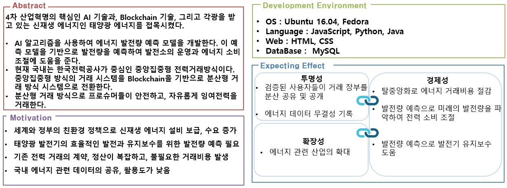
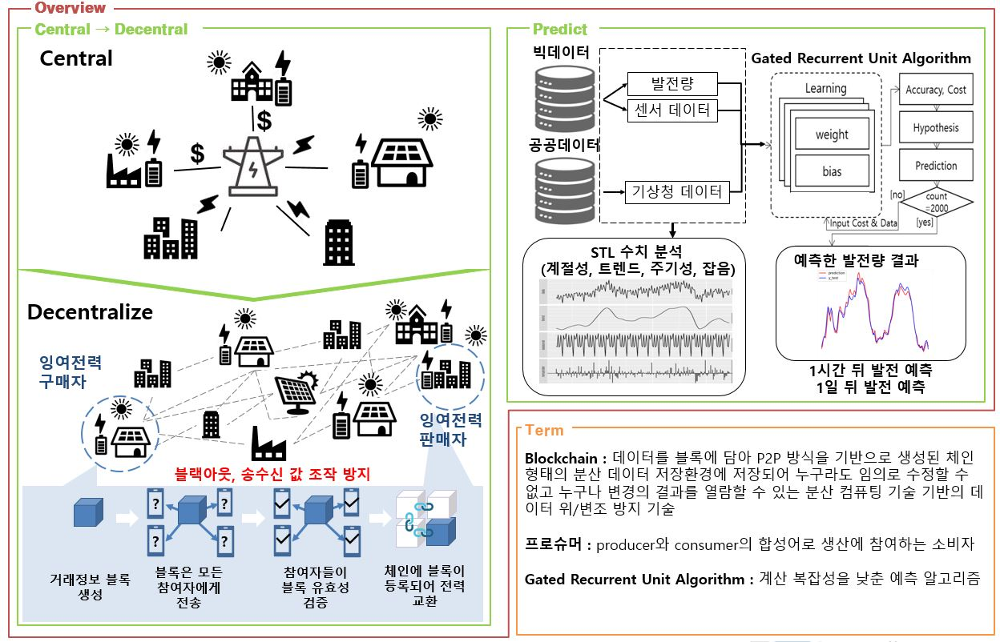
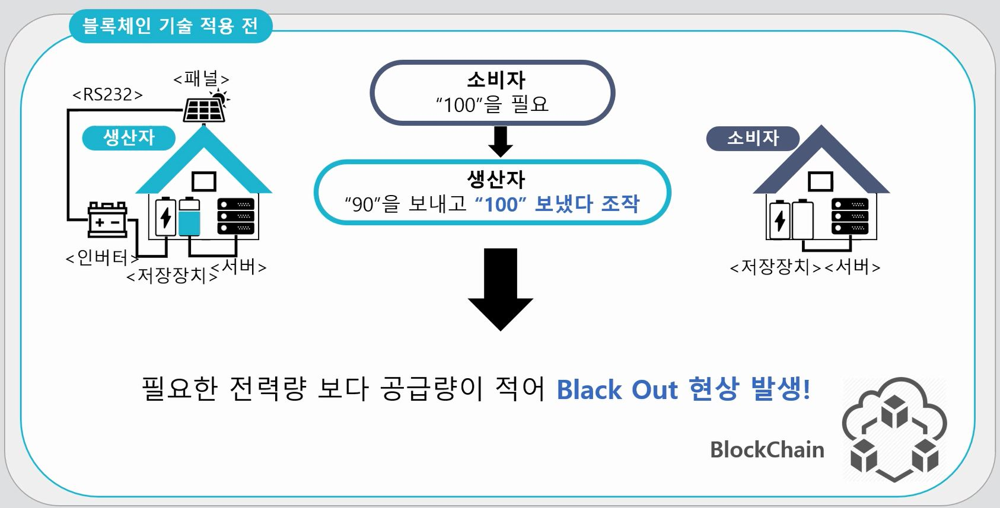
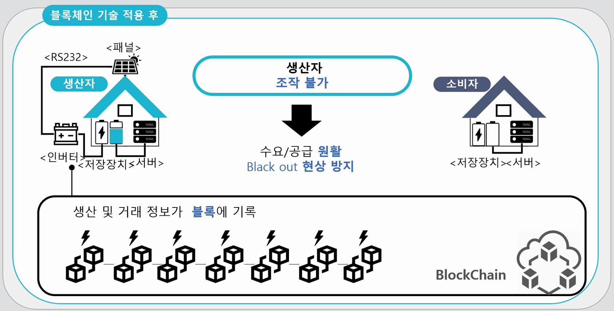
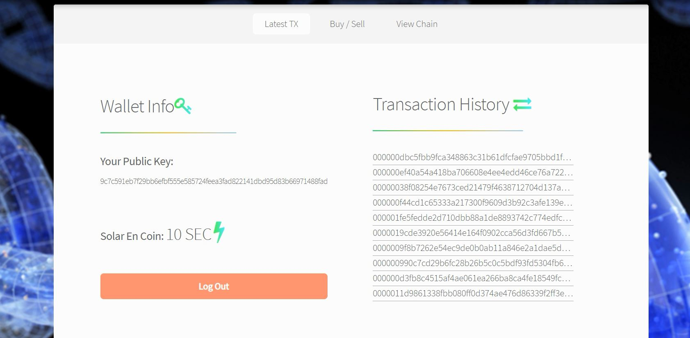
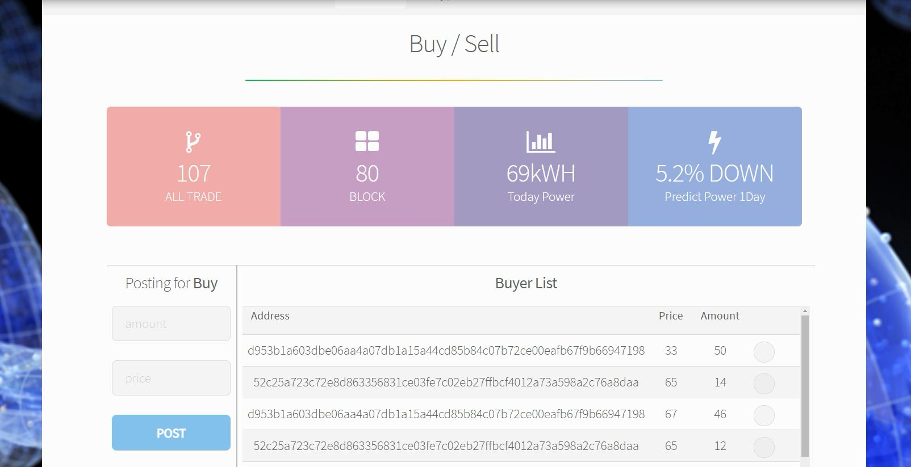
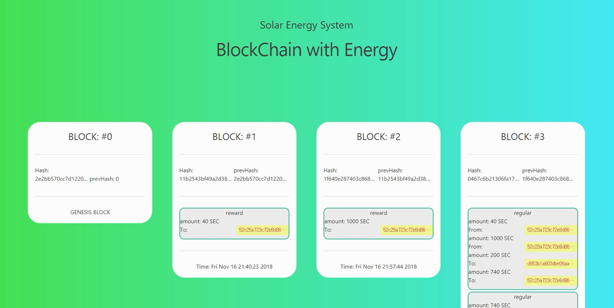

# 태양광 에너지 발전량 예측과 Blockchain을 이용한 에너지 거래소 구축 사례
## 2018년도 종합설계 프로젝트

### 전체 내용 요약
  

  

  
  
  

### 가시적인 전달을 위한 웹페이지 요약
**프로슈머 로그인**  

  

**자신의 월렛 상태, 트랜잭션 히스토리**  

  

**블록 수,거래 수, 발전량 상태, 예측 발전량 상태, 거래를 위한 게시판**  

**블록체인의 상태를 보여주기 위한 페이지**  

