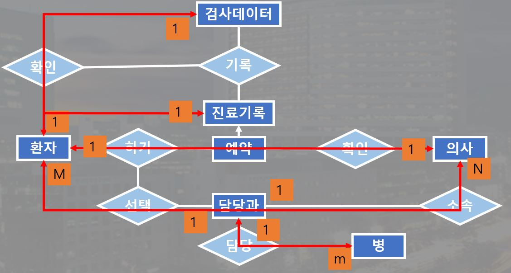
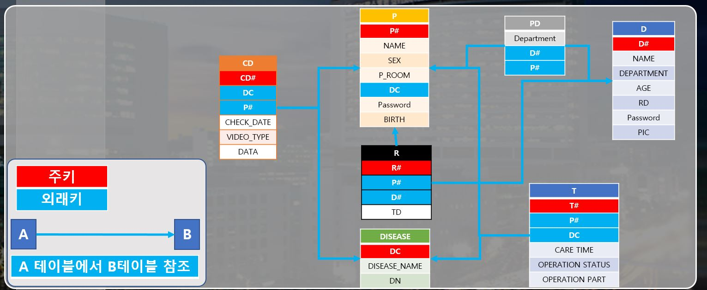
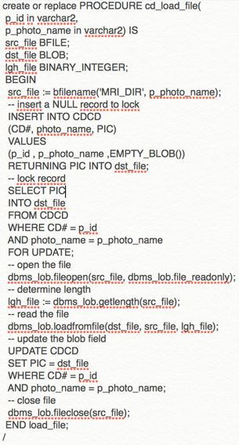
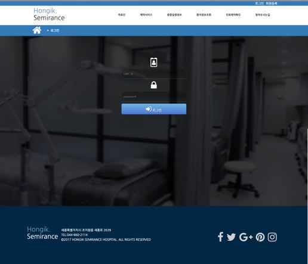
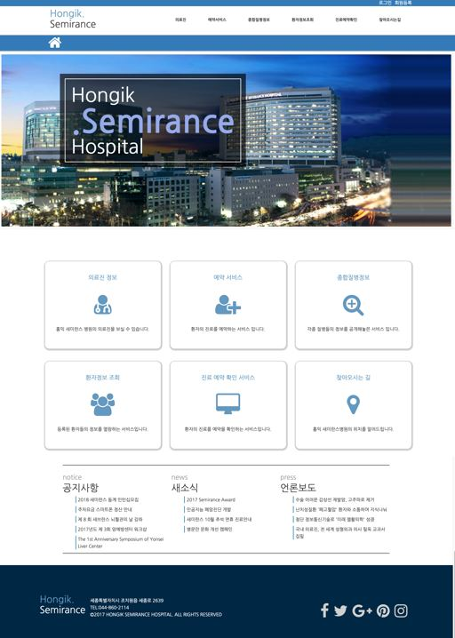
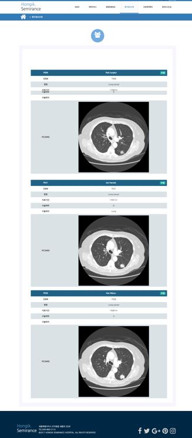
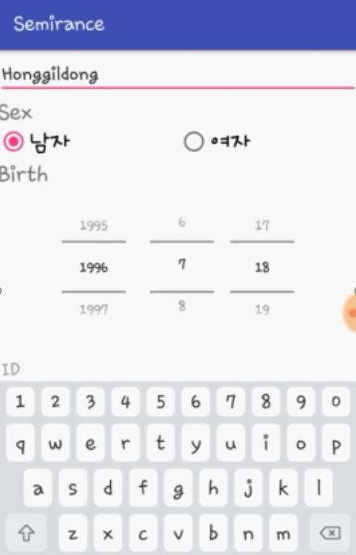
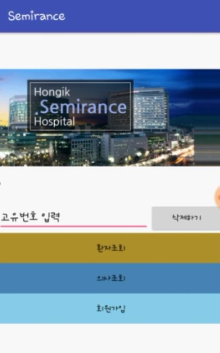

# DataBase Team Project 2017
##  3학년 2학기 디비 프로젝트
```
- Oracle DB(외부 서버)
- Android 모바일 연동
- html css
- php
```
### 의사
- 의사는 진료에 필요한 환자 정보를 조회할 수 있다
- 각각의 다른 진료과 별로 의사가 담당하는  환자의 예약정보, 진료기록, 검사정보, 병실 등을 조회한다.

### 환자
- 환자는 자신의 진료기록, 예약정보를 조회할 수 있다
- 환자의 정보가 입력 되면, 해당 진료과의 의사가 매칭된다
- 원하는 시간을 선택하여 예약을 할 수 있다

### DataBase Concept Schema 
<br>
### DataBase E-R Table
<br>


### 이미지 데이터를 넣기 위한 프로시져
데이터 베이스 내에 있는 테이블에 이미지를 넣기 위한 프로시저 사용
##### 프로시저(Procedure)란?
```
일련의 쿼리를 마치 하나의 함수처럼 실행하기 위한 쿼리의 집합	
테이블 칼럼 데이터 타입 = BLOB (binary larger object)
```
<br>

관리자, 의사, 환자 각 계정마다 홈페이지 기능을 달리 두었음
### Web Page Example
<br>
<br>
<br>

### Mobile Example
<br>
<br>
