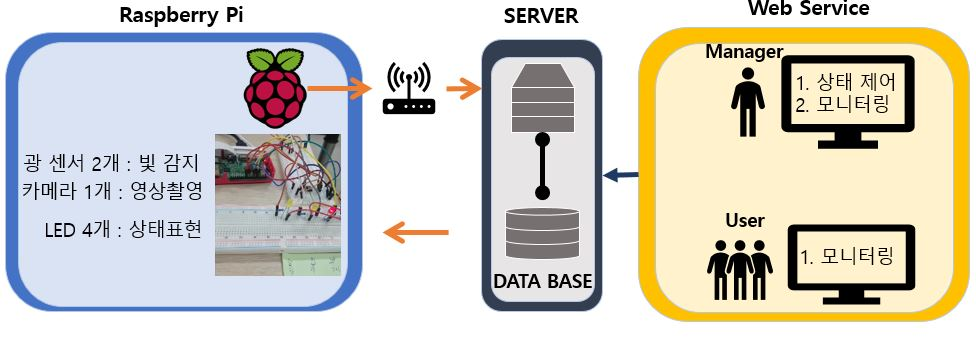
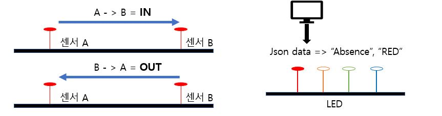
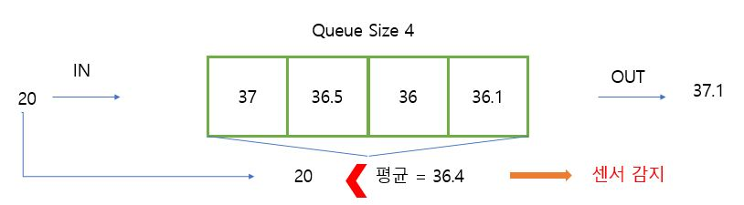
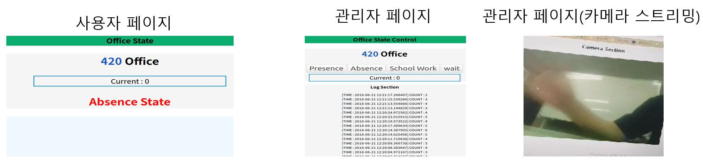

# 방 상태 제어, 모니터링

## 2018년 4학년 1학기 모바일 시스템 및 융합 과목 프로젝트
```
- Raspberry Pi
- json
- php
- 광 센서:2개
- 카메라: 1개
- LED: 4개
```
* 사무실, 연구실과 같은 곳에 업무가 있을 때, 방에 관리자가 부재중인 경우 다시 발걸음을 돌리는 경우가 있다. 방에 사람이 있는지 미리 확인을 하여 이를 방지한다.
* 방의 관리자는 원격으로 방의 재실 여부 등의 상태를 조작할 수 있다.
* 방의 관리자는 시스템의 카메라를 통해 방의 상태를 감시할 수 있다. 
* 시스템에 장착된 센서가 자동으로 방안의 재실, 부재를 파악하여 자동으로 재실 여부의 표시를 한다.

## 시스템 구조
권한이 없는 일반 사용자들은 방의 재실 여부 모니터링이 가능하다.
관리자는 센서들과, 카메라를 통해 방의 상태를 제어와 모니터링이 가능하다.<br>


## Raspberry Pi
* 2개의 광 센서를 사용하여 사람의 출입을 감지한다.
* 광 센서를 양쪽에 간격을 두어 설치하여 감지하는 순서에 따라 출입을 구별한다.
* 출입마다 구별한 데이터를 외부 서버 데이터베이스에  시간과 출/입 을 전송한다.
* 방안에 사람이 들어간 것으로 감지 되면 ‘재실 LED’가 켜지며, 아무도 없을 경우 ‘부재 LED’가 켜진다.
* 외부 서버의 Json {state: ””, color: ””} 형태의 데이터를 받아 값에 맞게 LED색을 전환한다.
* 파이 카메라를 사용한 영상 촬영을 서버에 스트리밍 한다.


### 광 센서 감지 방법
방들의 내부는 각각 빛의 양이 다르다.  
시간에 따른 햇빛의 양, 설치된 전등의 빛의 세기 등의 각각 다르기 때문에 광 센서의 감지 기준 값을 자동적으로 방 상태에 맞게 조절하는 것이 필요했다. 이를 위해 아래와 같이 작동하도록 만들었다.  

* 광 센서 감지는 큐 구조를 사용한다. 
* 0.3초 마다 입력되는 값을 큐에 저장한다.
* 큐 안의 데이터의 평균값보다 값이 작게 입력되면 감지 한다. 

실시간으로 큐에 입력된 빛의 양들이 변화하면서, 자동으로 감지되는 기준을 설정한다. 사람의 출입 시에 순간적으로 각기 다른 방의 빛 상황에서 가려지는 빛을 감지하기 위한 것이다.


## Server
* 라즈베리 파이에서 전송한 값을 수신하여 데이터베이스에 저장한다.
* 데이터베이스의 데이터를 기반으로 방안에 현재 몇 명이 있는지, 관리자의 설정과 함께 방의 상태를 웹 서비스한다.

* 관리자 페이지는 방안의 상태를 제어할 수 있으며, 제어버튼을 누르면 json 데이터가 생성된다.
* json 데이터는  라즈베리 파이에 전송되어 LED 센서로 방 상태를 표현한다. 
* 카메라를 통해 감시카메라 기능을 할 수 있다.
* 시간과 함께 남는 출입 로그를 확인할 수 있다.

* 사용자 페이지는 방안에 몇 명이 있는지, 부재여부를 확인할 수 있다.

웹페이지는 디자인을 신경쓰지 않음ㅎㅎ

### Web Page

