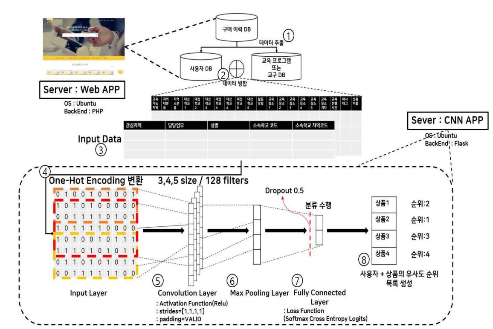

# Text-CNN 활용한 교육 컨텐츠 추천

## Convolutional Neural Network
```
- CNN은 주로 2차원 데이터인 영상, 이미지 처리에 사용된다
- 텍스트 데이터 처리에도 우수한 성능을 입증 [Yoon Kim 논문]
```
Yoonkim [Convolutional Neural Networks for Sentence Classification
](http://emnlp2014.org/papers/pdf/EMNLP2014181.pdf)


## CNN Layer
* Feature Extraction
    - Convolution Layer
    - Polling Layer
* Classification
    - Fully Connected Layer(with dropout and softmax)

`Convolution`: **필터**와 **합성곱 연산**으로 새로운 데이터 생성  

`Pooling`: 합성곱으로 생성된 데이터, 차원 감소 역할, **특징을 극소 ~ 극대화**

`Fully Connected`: **전체 입력 볼륨에 연결**되는 뉴런을 포함  

## CNN Layer for Text Data


`Input Layer`: 단어를 저차원 **벡터**로 임베드

`Convolution Layer`: **여러 크기의 필터**를 이용해 **벡터 단어를 합성곱**

`Pooling Layer`: 결과 값을 긴 **특징 벡터**로 풀링

`Fully Connected Layer`: **분류 판별** 수행(Classification)


## 추천 메커니즘들
### Contents Based and Collaborative 
#### Contents Based Filtering
- User Based - recommendation
```
* 사용자에 대한 "프로필"(성별, 연령대, 지역 .etc)
```
*나와 `프로필이 비슷한` 다른 사용자가 선호하는 컨텐츠를 추천*  

- Item Based - recommendation
```
* 아이템이 갖고있는 속성, 비슷한 "아이템"(색상, 모양, 아이템 유형)
```


*네이버 AItems, Youtube 영상 추천과 같은 방식*  

즉 `, [User-Profile] + [Item-Profile]`

#### Collaborative Filtering
- 프로필 데이터 없이, 사용자의 과거 행동 데이터를 기반한 추천


토이스토리, 맨인블랙 `평점이 비슷한 A,B`를 보고 B에게 어벤져스를 추천
```
단점 : 신규 사용자의 경우, 관찰된 행동 데이터가 없거나 적다
```
## 구성
#### Web Server 구성
- Ubuntu 18.04
- PHP 7.2.24
- Apache 2.4.29
- MySQL 5.7.28
- FTP
#### CNN Application 구성
- Tensorflow-gpu 1.12.0 (당시 낮은 버전)
- Python 3.6
- Cuda 9.0
- CUDNN 7.1.4

## 전체 구조

- 구매이력 데이터에서 사용자DB + 교육 프로그램 또는 교구DB 추출 및 전처리
- Text-CNN 분류 학습 진행
- 사용자가 이전에 사용했던 상품 제거
- 사용자의 지역과 일치 하지 않는 지역 제거
- 리뷰 평점 높은 순, 유사도가 높은 우선 순위 리스트 최대 4개 출력


##### 사용자가 `키워드`를 입력하면 `사용자 데이터`, `아이템 데이터`를 통해 `추천 리스트 출력`  

##### `서로 다른 사용자`가 `같은 키워드`를 입력했을 때 `서로에게 맞는 결과` 값 제공

## 새로 배운점
#### 하드웨어 자원 활용
초기에는 GPU 2개를 학습용, 모델 값 제공용에 모두 활용하려 했었다.
그러나 이는 자원적 낭비인 것을 알고, 방법을 생각하던 중 Tensorflow에서 자원 설정을 할 수 있는 것을 알았다.(과거엔 몰랐네)
그래서 새로운 학습 데이터가 생길 때는 자동으로 GPU를 사용한 학습을 진행하고,
평상시 추천 목록 요청에는 CPU를 사용한 학습 모델 사용을 하는 방식으로 변경했다.


## 아쉬운점
교육 업체와 하는 프로젝트 였다.
그러나 아이디어 구상 및 회의, 설계, 개발, 문서 작업 등을 혼자 맡게 된 것이라 너무 힘들었던 프로젝트..  

비전공자와(고객)의 의사소통이 어렵지만 중요함을 많이 배우게 되었다.
