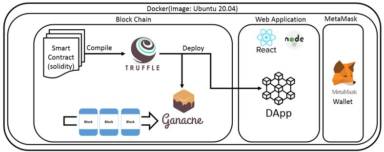
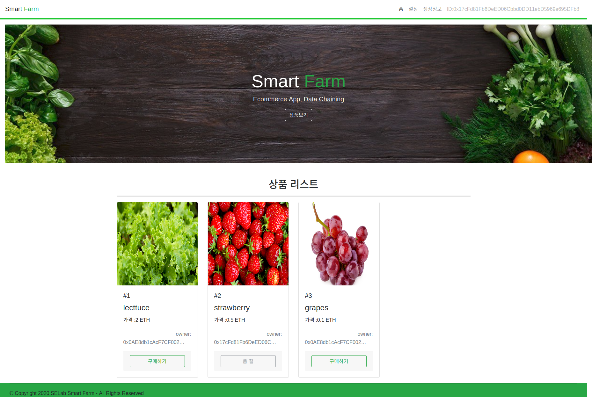
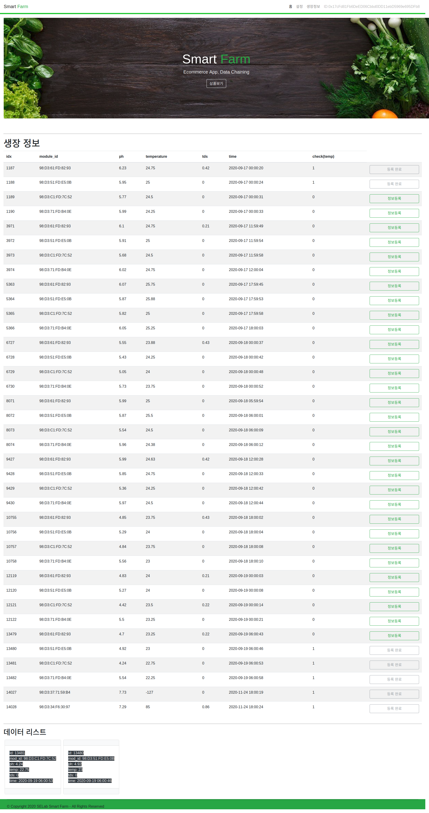

# 스마트재배와 블록체인을 이용한 식물재배 정보 위조방지 기술 연구

## 개발 구성

```
- Ubuntu
- Docker
- Truffle
- Ganache-cli
- Solidity
- MetaMask
- NodeJS
- React
```

* Dapp을 개발하고 유지보수, 관리, 배포를 쉽게 하기 위해 Docker에 올려 이미지화
* 그 내부에는 Block Chain, Web Application, MetaMask의 Wallet 기능을 배치
* Solidity 코드로 작성된 스마트 컨트랙트를 Truffle을 활용하여 테스트와 배포
* 배포된 스마트 컨트랙트를 기반으로 Ganache 이더리움 플랫폼에서 사용할 Block들이 생성되어 관리되도록 함  

**COVID-19 로 인한 팬데믹 격리 상황에서 사람들 간의 접촉이 불가능한 상황 뿐만 아니라
일반적인 상황에서도 식/작물 거래 및 재배에 대한 노하우 데이터를 위변조 불가능한 블록체인 기술로 정보 위조 방지와 공유가 가능하고
재배한 식/작물 거래 장터를 개발**

`식물 생장 관련 정보`와 `식물 회계 정보`를 데이터화 하여 활용할 수 있는 확장성을 갖고 있음  

## 필요성
```
- 정보 기술의 발전으로 스마트 기술과 결합한 식물 재배 증가
- 스마트팜의 수경재배 시스템으로부터 생산되는 다양한 데이터 관리 필요
- 수경재배로 관리되는 식물들의 거래 시스템 데이터 관리 필요
- 재배 및 거래 시스템 상의 데이터 위변조로 불공정한 운영 및 거래 발생 가능성
- 블록체인 기술을 결합하여 거래 조작 방지, 재배 관련 데이터 관리 가능
- 농작물 거래 사이에 불필요한 중개료를 제거하여 더 합리적인 거래 가격 조정이 가능
- 블록체인 기술을 이용하여 농산물의 재배 정보 등을 소비자가 직접 확인할 수 있기 때문에 더욱 신뢰할 수 있는 환경을 제공
```

## 구현 화면 페이지
##### 메인 페이지

##### 상품 등록, 블록 페이지
![items]../../images/projects/smart_farm/items.png)
##### 식물 생장 정보, 블록 페이지


#### 기능
* 상품 등록 
* 상품 보기 및 구매
* 상품 관련 블록 리스트 보기
* 식물 생장 정보 블록화
* 식물 관련 블록 리스트 보기


학부 때는 javascript로 블록체인을 적용했었지만, 이 프로젝트 때 처음으로 이더리움 플랫폼과 이를 개발하기 위해 리액트, 가나슈, 트러플을 사용해 보았음
도커 부분 명령어 좀 다듬어야 할 것 같은데.. 다른 연구, 개발에 치여 하지 못한 것이 아쉽다

