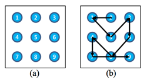
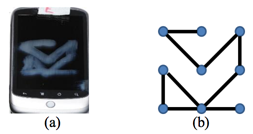
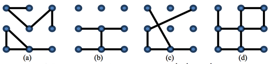
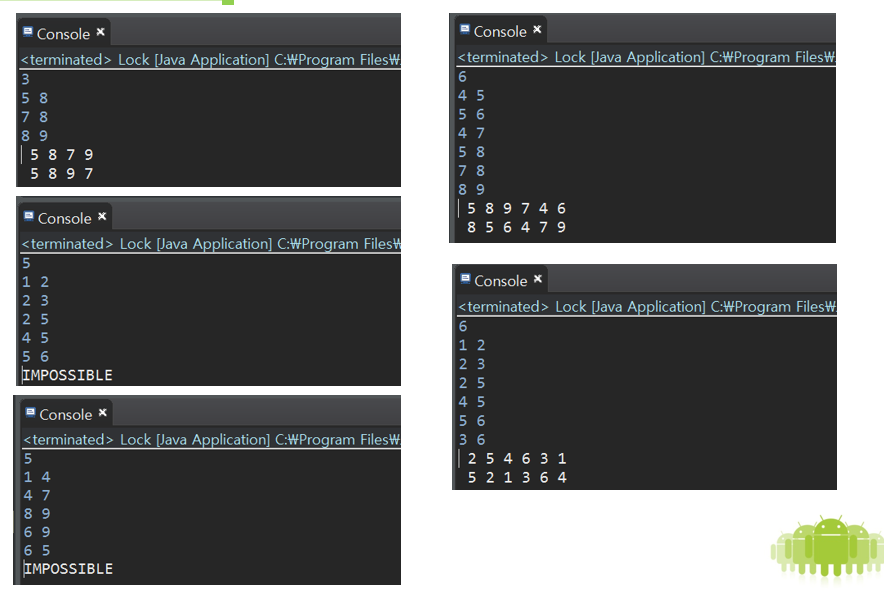

# 알고리즘 문제(패턴락)
## 백준 8894번 문제, Asia Regional - Daejeon 2012 G번


## 문제
Pattern lock security is generally used in Android handsets instead of a password. The pattern lock can be set by joining points on a 3×3 matrix in a chosen order. The points of the matrix are registered in a numbered order starting with 1 in the upper left corner and ending with 9 in the bottom right corner. This pattern must involve at least 4 points to set, cannot be disconnected and each point number can be used at most once. So the pattern of the lock screen in Figure 1(b) would be 2-1-5-3-6-8-4-7-9.
  

In Figure 1(b), since the point 8 is already visited, you can connect from point 7 to point 9 directly. If the point 8 is not visited yet, you cannot connect from point 7 to point 9 directly.

Though Chulsoo has completely forgotten his pattern, he can get his pattern image as a geometric graph from his smudged smartphone screen such as Figure 2.  
  

For example, let’s consider four geometric graphs in Figure 3. Since the graph in Figure 3(a) is disconnected, this pattern is not possible to construct. Even though the graph in Figure 3(b) is connected, this pattern cannot be constructed. That is, there is no sequence joining points that makes the given pattern. The pattern given in Figure 3(c) can be constructed by the point-joining sequence 1-8-9-7-4-3 only. The pattern given in Figure 3(d) can be constructed by 4-5-6-3-2-8-9-7-1 or 8-5-2-3-6-4-1-7-9.  
  

You are going to find Chulsoo’s pattern lock from his pattern image. Given a pattern image as a geometric graph, write a program to find a possible pattern lock sequence. 

## 입력
Your prgram is to read from standard input. The input consists of T test cases. The number of test cases T is given in the first line of the input. Each test case starts with a line containing an integer e (3 ≤ e ≤ 24), where e is the number of edges of the geometric graph. In the next e lines of each test case, the i-th line contains two integers si, di (i = 1, 2, ..., e and 1 ≤ si, di ≤ 9), which represent an edge between si and di.
## 출력
Your program is to write to standard output. For each test case, if it can be possible to recover a pattern code, print a point joining sequence which makes a pattern. Otherwise, print “IMPOSSIBLE”.
## 예제 입력
```
6
3
5 8
7 8
8 9
3
5 8
7 8
8 9
6
4 5
5 6
4 7
5 8
7 8
8 9
6
1 2
2 3
2 5
4 5
5 6
3 6
5
1 2
2 3
2 5
4 5
5 6
5
1 4
4 7
8 9
6 9
6 5
```
## 예제 출력
```
5 8 9 7
5 8 7 9
5 8 9 7 4 6
2 5 4 6 3 1
IMPOSSIBLE
IMPOSSIBLE
```
[출처](https://www.acmicpc.net/category/detail/1060)   

----------------------------------------------------
## 해결
지나간 패턴대로 버튼마다 서로 연결을 해준다. 연결 된 상태의 버튼들은 서로 갈 수 있는 경로를 확인하여 경로를 정한다.  경로를 정할때는 트리구조를 이용하여 탐색한다.
## 소스코드  
#### Button.java

package 알고리즘;

import java.util.ArrayList;

public class Button {
	Button prev=null;
	Button doubPtr=null;
	Button next=null;
	int number;	
	boolean state=false;
	boolean mark=false;
	boolean doubCon=false;
	boolean jump=false;
	ArrayList<Button> route=new ArrayList<Button>();
	
	public Button(int number){
		this.number=number;
		
	}
	public void routePtr(Button btn){
			btn.state=true;
			route.add(btn);
			
		}
	
	
	public void printRoute(){
		System.out.print("Button["+this.number+"]'s "+"Route :");
		for(int i=0;i<route.size();i++){
			System.out.print(" "+route.get(i).number);
		}
	}
	@Override
	public String toString() {
		printRoute();
		return "\nButton [number=" + number + ", mark=" + mark + ", state= "+state+"]";
	}
	
}


#### Lock.java

package 알고리즘;

import java.util.ArrayList;
import java.util.Scanner;

public class Lock {
	ArrayList<Button> btn = new ArrayList<Button>();
	ArrayList<Button> onBtn = new ArrayList<Button>();
	ArrayList<Button> tempL = new ArrayList<Button>();
	ArrayList<Button> resultQ = new ArrayList<Button>();
	Scanner sc = new Scanner(System.in);
	Button head;
	int numCount;

	int count, first, second;
	Boolean possible = false;

	public Lock() {
		makeBtn();
		
		count = sc.nextInt();
		for (int i = 0; i < count; i++) {
			connect(first = sc.nextInt(), second = sc.nextInt());
		}
		sc.close();
		setBtn();
		connectDouble();
	//	print();

		tempL = onBtn;
		for (int i = 0; i < onBtn.size(); i++) {
			numCount = 0;
			onBtn.get(i).mark = true;
			head = onBtn.get(i);
			// System.out.println("\nS:"+head.number);
			search(head);
			onBtn.get(i).mark = false;
			onBtn = tempL;
		}
		checkPossible();

	}

	public void makeBtn() {
		for (int i = 1; i < 10; i++) {
			btn.add(new Button(i));
		}

	}

	public void setBtn() {
		for (int i = 0; i < btn.size(); i++) {
			if (btn.get(i).state == true)
				onBtn.add(btn.get(i));
		}
		btn = null;
		tempL = onBtn;
	}

	public void checkPossible() {
		if (!possible) {
			System.out.println("IMPOSSIBLE");
		}
	}

	public void connect(int first, int second) {
		Button a = btn.get(first - 1);
		Button b = btn.get(second - 1);
		a.routePtr(b);
		b.routePtr(a);
	}

	public Boolean connectDouble() {
		for (int i = 0; i < onBtn.size(); i++) {
			if (onBtn.get(i).number == 2) {
				checkDouble(onBtn.get(i), 1, 3);
			} else if (onBtn.get(i).number == 4) {
				checkDouble(onBtn.get(i), 1, 7);
			} else if (onBtn.get(i).number == 6) {
				checkDouble(onBtn.get(i), 3, 9);
			} else if (onBtn.get(i).number == 8) {
				checkDouble(onBtn.get(i), 7, 9);
			} else if (onBtn.get(i).number == 5) {
				checkDouble(onBtn.get(i), 1, 9);
				checkDouble(onBtn.get(i), 2, 8);
				checkDouble(onBtn.get(i), 3, 7);
				checkDouble(onBtn.get(i), 4, 6);
			}
		}
		return true;
	}

	public void checkDouble(Button med, int num1, int num2) {
		int check = 0;
		Button[] btn = new Button[2];
		for (int j = 0; j < med.route.size(); j++) {
			if (med.route.get(j).number == num1 || med.route.get(j).number == num2) {
				btn[check] = med.route.get(j);
				check++;

				if (check == 2) {
					btn[0].doubCon = true;
					btn[1].doubCon = true;
					btn[0].doubPtr = med;
					btn[1].doubPtr = med;
					btn[0].routePtr(btn[1]);
					btn[1].routePtr(btn[0]);

				}
			}
		}

	}

	public Boolean completeCheck() {
		boolean comCheck = false;
		int comCount = 0;
		for (int i = 0; i < onBtn.size(); i++) {
			if (onBtn.get(i).mark == true) {
				comCount++;
			}
		}
		if (onBtn.size() == comCount)
			comCheck = true;
		return comCheck;
	}

	public void search(Button parent) {
		/*if (parent.prev != null)
			System.out.println(parent.prev.number + "->" + parent.number);*/

	//	System.out.println(numCount);
		if (completeCheck() && numCount == count) {
			possible = true;
			do {
				resultQ.add(parent);
				parent = parent.prev;
			} while (parent.prev != null);
			resultQ.add(head);
			for (int i = resultQ.size(); i > 0; i--)
				System.out.print(" "+resultQ.get(i - 1).number);
			System.out.println();
			resultQ.clear();
		}
		if (parent.jump == true && parent.doubPtr == head) {
			numCount++;
			numCount++;
		} else {
			numCount++;
		}

		for (int i = 0; i < parent.route.size(); i++) {

			if (parent.route.get(i).mark == false) {
				if (parent.route.get(i).doubCon == true) {
					if (parent.route.get(i).doubPtr.mark == false) {
						continue;
					} else {
						parent.route.get(i).jump = true;
					}
				}

				parent.route.get(i).prev = parent;
				parent.route.get(i).mark = true;
				parent.next = parent.route.get(i);
				search(parent.route.get(i));
				if (parent.route.get(i).doubPtr == head && parent.route.get(i).jump == true) {
					numCount--;
					numCount--;
				} else {
					numCount--;
				}
				parent.route.get(i).jump = false;
				parent.route.get(i).mark = false;
				parent.route.get(i).prev = null;
				parent.next = null;

			}

		}

	}

	public void print() {
		for (int i = 0; i < onBtn.size(); i++) {
			System.out.println(onBtn.get(i).toString());
		}
	}

	public static void main(String[] args) {
		// TODO Auto-generated method stub
		Scanner sc= new Scanner(System.in);
		String s="";
		ArrayList<Lock> l = new ArrayList<Lock>(
				);
		Lock a = null;
		int count = sc.nextInt();
		for(int i=0;i<count;i++){
				l.add(a);
		}
		for(int i=0;i<l.size();i++){
		new Lock();
	}
		sc.close();
		

	}

}


## 결과

