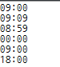

# 카카오 문제(셔틀버스)
### 카카오 신입 공채 1차 코딩 테스트 4번

## 4. 셔틀버스(난이도: 중)

카카오에서는 무료 셔틀버스를 운행하기 때문에 판교역에서 편하게 사무실로 올 수 있다. 카카오의 직원은 서로를 '크루'라고 부르는데, 아침마다 많은 크루들이 이 셔틀을 이용하여 출근한다.

이 문제에서는 편의를 위해 셔틀은 다음과 같은 규칙으로 운행한다고 가정하자.

- 셔틀은 `09:00`부터 총 `n`회 `t`분 간격으로 역에 도착하며, 하나의 셔틀에는 최대 `m`명의 승객이 탈 수 있다.
- 셔틀은 도착했을 때 도착한 순간에 대기열에 선 크루까지 포함해서 대기 순서대로 태우고 바로 출발한다. 예를 들어 `09:00`에 도착한 셔틀은 자리가 있다면 `09:00`에 줄을 선 크루도 탈 수 있다.

일찍 나와서 셔틀을 기다리는 것이 귀찮았던 콘은, 일주일간의 집요한 관찰 끝에 어떤 크루가 몇 시에 셔틀 대기열에 도착하는지 알아냈다. 콘이 셔틀을 타고 사무실로 갈 수 있는 도착 시각 중 제일 늦은 시각을 구하여라.

단, 콘은 게으르기 때문에 같은 시각에 도착한 크루 중 대기열에서 제일 뒤에 선다. 또한, 모든 크루는 잠을 자야 하므로 `23:59`에 집에 돌아간다. 따라서 어떤 크루도 다음날 셔틀을 타는 일은 없다.

### 입력 형식

셔틀 운행 횟수 `n`, 셔틀 운행 간격 `t`, 한 셔틀에 탈 수 있는 최대 크루 수 `m`, 크루가 대기열에 도착하는 시각을 모은 배열 `timetable`이 입력으로 주어진다.

- 0 ＜ `n` ≦ 10
- 0 ＜ `t` ≦ 60
- 0 ＜ `m` ≦ 45
- `timetable`은 최소 길이 1이고 최대 길이 2000인 배열로, 하루 동안 크루가 대기열에 도착하는 시각이 `HH:MM` 형식으로 이루어져 있다.
- 크루의 도착 시각 `HH:MM`은 `00:01`에서 `23:59` 사이이다.

### 출력 형식

콘이 무사히 셔틀을 타고 사무실로 갈 수 있는 제일 늦은 도착 시각을 출력한다. 도착 시각은 `HH:MM` 형식이며, `00:00`에서 `23:59` 사이의 값이 될 수 있다.

### 입출력 예제

| n | t | m | timetable | answer |
| - | - | - | --------- | ------ |
| 1 | 1 | 5 | ["08:00", "08:01", "08:02", "08:03"] | "09:00" |
| 2 | 10 | 2 | ["09:10", "09:09", "08:00"] | "09:09" |
| 2 | 1 | 2 | ["09:00", "09:00", "09:00", "09:00"] | "08:59" |
| 1 | 1 | 5 | ["00:01", "00:01", "00:01", "00:01", "00:01"] | "00:00" |
| 1 | 1 | 1 | ["23:59"] | "09:00" |
| 10 | 60 | 45 | ["23:59","23:59", "23:59", "23:59", "23:59", "23:59", "23:59", "23:59", "23:59", "23:59", "23:59", "23:59", "23:59", "23:59", "23:59", "23:59"] | "18:00" |

### 문제 해설

쉬워 보이는데 어려운 문제가 바로 이 문제였던 거 같네요. 당초 난이도를 '중'으로 두고 문제를 중간 즈음에 배치하였는데, 시간을 계산하는 부분에서 많은 분들이 어려워하셨던 거 같습니다.

예를 들어 2번 입출력 예제의 경우 `["09:10", "09:09", "08:00"]`인데 이 경우 두 번째 버스는 9:10분에 출발하기 때문에 9:10분에 오면 되지 않느냐 많이들 혼동하셨을 거 같아요. 하지만 9:00에 오는 버스는 8:00에 대기하는 크루 1명만 탑승할 수 있고, 따라서 9:10 버스에는 남아 있는 두 명이 모두 타게 됩니다. 따라서 좀 더 이른 9:09에 와야 탑승할 수 있습니다.

전체 계산은 어렵지 않지만 이처럼 정확하게 시간 계산을 해야 하는 부분이 많고 마지막 버스 시간까지 빈틈없이 계산해야 해서 많은 분들이 실수를 한 거 같습니다.  
**이 문제는 정답률이 두 번째로 낮은 26.79%입니다.**  
  

  **[문제 출처](http://tech.kakao.com/2017/09/27/kakao-blind-recruitment-round-1/)**  
    
-------------------------------------------------------------------------
### 해결
실전에서 풀었으면 망했을 문제였다. 문제를 이해하는 것 부터 쉽지 않았다... 나는 그냥 문제 그대로 무식하게 대기 순으로 먼저 태우고 그 안에서 콘이 탈 시간을 찾는 방법을 썻다.
- 크루들의 도착시간을 다 받아와 분단위로 고쳐준다.
- 분단위의 타임테이블을 오름차순 정렬을 한다.
- 버스의 도착시간때 마다 버스를 생성하고 태운다.  

순서는 뒤에서부터 시작한다 (막차->첫차)

- 마지막 버스가 FULL이면 그 버스에 탄 크루들의 시간을 비교
    - (제일 마지막 순서 시간 > 그 앞 순서 시간 ) 이면 = 마지막 시간-1분
    - 크루들의 도착시간이 같다면 탐색 공간이 앞 순서의 버스로 바뀌며 반복
- 버스가 FULL이 아니면 버스 도착시간에 콘이 도착하면 된다.  

### 소스코드

import java.util.ArrayList;
import java.util.Collections;

class Bus {
	int arriveTime;
	int[] seat;
	boolean full = false;

	public Bus(int seat, int arriveTime) {
		this.seat = new int[seat];
		this.arriveTime = arriveTime;
	}

	public boolean isFull() {
		return full;
	}

	public void setFull(boolean full) {
		this.full = full;
	}

}

public class Scheduling {
	int firstBusTime = 540;// 09시를 분단위로 540분
	int n, t, m;
	ArrayList<Integer> times = new ArrayList<Integer>();
	String[] timeTable;
	Bus[] bus;

	public Scheduling(int n, int t, int m, String[] timeTable) {
		if ((0 < n && n <= 10) && (0 < t && t <= 60) && (0 < m && m <= 45)
				&& (0 < timeTable.length && timeTable.length <= 2000)) {
			this.n = n;
			this.t = t;
			this.m = m;
			this.timeTable = timeTable;
			convertMin();
			setBus();
			result();
		} else {
			System.out.println("입력 값 에러");
		}
	}

	public void convertMin() {// 분단위변환
		for (int i = 0; i < timeTable.length; i++) {
			String[] min = timeTable[i].split(":");
			times.add((Integer.parseInt(min[0]) * 60) + Integer.parseInt(min[1]));
		}
		Collections.sort(times);
	}
	public void convertHour(int time){
		String hour=String.format("%02d",time/60);
		String min = String.format("%02d", time%60);
		System.out.println(hour+":"+min);
	}

	public void setBus() {
		bus = new Bus[n];
		int b = 0;
		for (int currentTime = firstBusTime; currentTime <= firstBusTime + (t * (n - 1)); currentTime += t) {
			int seatNum = 0;
			bus[b] = new Bus(m, currentTime);
			for (int i = 0; i < times.size(); i++) {
				if (times.get(i) > currentTime) {
					break;
				} else if (times.get(i) <= currentTime) {
					bus[b].seat[seatNum] = times.get(i);
					times.remove(i);
					i = -1;
					seatNum++;
					if (seatNum == m) {
						bus[b].setFull(true);
						break;
					}
				}
			}
			b++;
		}
	}

	public void result() {
		int res = 0;
		for (int i = bus.length - 1; i >= 0; i--) {
			if(bus[i].isFull()){//꽉참
				int[] seat=bus[i].seat;
				for(int j=seat.length-1;j>0;j--){
					res=seat[j-1];
					if(seat[j]>seat[j-1]){
						convertHour(seat[j]-1);
						return;
					}
				}
			}else {
				convertHour(bus[i].arriveTime);
				return;
			}
		}
		convertHour(res-1);
	}

	public static void main(String[] args) {
		String[] c1 = { "08:00", "08:01", "08:02", "08:03" };
		String[] c2 = { "09:10", "09:09", "08:00" };
		String[] c3 = { "09:00", "09:00", "09:00", "09:00" };
		String[] c4 = { "00:01", "00:01", "00:01", "00:01", "00:01" };
		String[] c5 = { "23:59" };
		String[] c6 = { "23:59", "23:59", "23:59", "23:59", "23:59", "23:59", "23:59", "23:59", "23:59", "23:59",
				"23:59", "23:59", "23:59", "23:59", "23:59", "23:59" };
		new Scheduling(1, 1, 5, c1);
		new Scheduling(2, 10, 2, c2);
		new Scheduling(2, 1, 2, c3);
		new Scheduling(1, 1, 5, c4);
		new Scheduling(1, 1, 1, c5);
		new Scheduling(10, 60, 45, c6);
	}
}



### 결과

