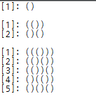
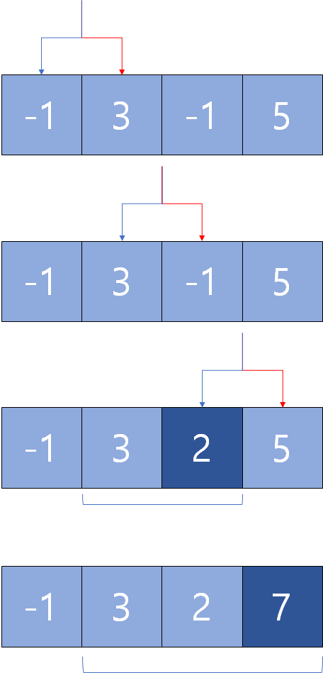
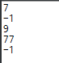
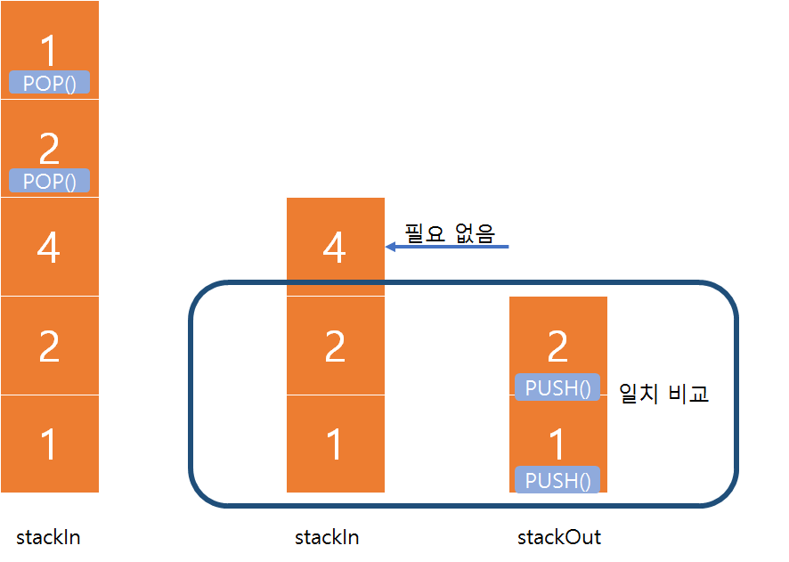
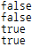
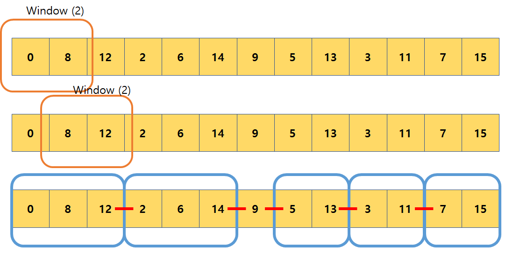
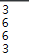

# 실리콘밸리 코딩테스트
## 알콜리즘
## 문제 1. 
**정수 n이 주어지면, n개의 여는 괄호 “(“와 n개의 닫는 괄호 “)”로 만들 수 있는 괄호 조합을 모두 구하시오. `(시간 복잡도 제한 없습니다)`.**
### 예제
```
Input: 1
Output: [“()”]

Input: 2
Output: [“(())”, “()()”]

Input: 3
Output: [“((()))”, “(()())”, “()(())”, “(())()”, “()()()”]
```
--------------------
### 해결
`(` 와 `)` 의 갯수를 통해 재귀적인 함수 호출을 한다.  각 호출의 첫 호출은 `(` 여는 괄호가 먼저 나와야 시작하기 때문에 `(` 갯수를 -1 하여 호출... 이런식으로 재귀 수행하며 함수를 빠져나오면 `)`에 대한  재귀 수행을 함.


public class Bracket {
	int count = 0;

	public Bracket(String data, int num) {
		bracket(data, num, num);
		System.out.println();
	}

	public void bracket(String data, int open, int close) {
		if (open > close)
			return;
		if (open == 0 && close == 0) {
			count++;
			System.out.println("[" + count + "]: " + data);
			return;
		}
		if (open < 0 || close < 0)
			return;
		bracket(data + '(', open - 1, close);
		bracket(data + ')', open, close - 1);
	}

	public static void main(String[] args) {
		new Bracket("", 1);
		new Bracket("", 2);
		new Bracket("", 3);
	}
}


### 결과

## 문제 2.
**정수 배열(int array)가 주어지면 가장 큰 이어지는 원소들의 합을 구하시오. `단, 시간복잡도는 O(n).`**
### 예제
```
Input: [-1, 3, -1, 5]
Output: 7 // 3 + (-1) + 5

Input: [-5, -3, -1]
Output: -1 // -1

Input: [2, 4, -2, -3, 8]
Output: 9 // 2 + 4 + (-2) + (-3) + 8
```
-----------------------------------------------
### 해결
배열의 시작은 i=1부터 시작 한다. i의 이전인 i-1번째에는 연속된 배열의 합을 넣을 것이다.
- i-1번째 숫자가 0보다 작은 수라면 i번째 수와 합하지 않는다.
- 수행마다 기존의 max보다 크다면 값을 갱신한다.



//시간 복잡도 O(n) 생각
public class SumMax {

	public SumMax(int[] input) {
		int max = input[0];
		int result = max;
		for (int index = 1; index < input.length; index++) {
			if (input[index - 1] > 0) {
				input[index] += input[index - 1];
				result = input[index];
			} else
				result = input[index];

			if (max < result)
				max = result;

		}
		System.out.println(max);
	}

	public static void main(String[] args) {
		int[] c1 = { -1, 3, -1, 5 };
		int[] c2 = { -5, -3, -1 };
		int[] c3 = { 2, 4, -2, -3, 8 };
		int[] c4 = { 33, 36, -73, 15, 43, -17, 36, -28, -1, 21 };
		int[] c5 = { -3, -5, -1, -2 };

		new SumMax(c1);
		new SumMax(c2);
		new SumMax(c3);
		new SumMax(c4);
		new SumMax(c5);
	}
}


### 결과

## 문제 3.
**정수 (int) 가 주어지면, 팰린드롬인지 알아내시오. 랠린드롬이란, 앞에서부터 읽으나 뒤에서부터 읽으나 같은 단어를 말한다. 단, 정수를 문자열로 바꾸면 안된다.**
### 예제
```
input: 12345 
output : False

input -101
output: False

input: 11111
output:True

input:12421
output:True
```
------------------------------------------
### 해결

- 음수라면 처음부터 맨 앞자리의 글과, 맨 뒷자리의 글이 다를 수 밖에 없으니 `false` 출력.
- 수의 각 자리마다 스택에 `PUSH` 한다.
- 채워진 스택 길이의 반만큼 `POP` 하며 이를 다른 스택에 `PUSH`
- 반으로 쪼개진 두 스택을 비교한다. (홀수의 경우 가운데 숫자는 비교 하지 않아도 된다)


import java.util.Stack;

public class Palindrome {
	Stack<Integer> stackIn = new Stack<Integer>();
	Stack<Integer> stackOut = new Stack<Integer>();

	public Palindrome(int input) {
		if (input < 0) {
			System.out.println(false);
		} else {
			while (input > 0) {
				stackIn.push(input % 10);// 각 자리마다 스택에 push
				input = input / 10;
			}
			int len = stackIn.size() / 2;
			for (int index = 0; index < len; index++) {
				stackOut.push(stackIn.pop());
			}
			System.out.println(stackIn.containsAll(stackOut));
		}

	}

	public static void main(String[] args) {
		new Palindrome(12345);
		new Palindrome(-101);
		new Palindrome(111111);
		new Palindrome(12421);

	}
}


### 결과

## 추가문제 1. 마이크로소프트 
정수 배열이 주어지면 가장 긴 커지는 원소들의 집합의 길이를 구하시오.
### 예제
```
Input: [10,9,0,7,2,5]
Output: 3 // 0,2,5

Input: [0,8,12,2,6,14,9,5,13,3,11,7,15]
Output: 6 // 0,2,6,9,11,15
```
-----------------------------------
### 해결
총 4문제중에 가장 고민이 많았던 문제였다.  
처음 생각했던 법은, 원소마다 리스트나 스택을 생성하여 매 실행시 비교하는 방법.. 이를 쓰기에는 엄청나게 성능이 떨어질 것이다. 따라서 다른 것을 고민한 결과...

푸는 힌트에는 세그먼트 트리, 이분법이 있다고 한다.  
세그먼트 트리의 분할 수행 방식을 보고 떠오른 방법을 적용하였다.  

(반복문 하나로 모든 원소 탐색을 함. 설계한 복잡도는 O(N))  
- **주황색**은 윈도우로, 반복문에서  i번째와 i+1번째, 두 원소를 비교한다.
- **파란색**은 원소 비교시, 연속적으로 오름차순이면 그 배열은 한 묶음이 된다.  
- **빨간색**은  원소 비교시 오름차순이 아닌 것을 의미한다.
- **입력 배열의 총 길이** - **파란색** - **빨간색** = **길이** 



public class Longest {
	int over = 0;
	int unvalue = 0;
	boolean flag = false;
	boolean conflag = false;

	public Longest(int[] input) {
		int len = input.length;
		for (int i = 0; i < len - 1; i++) {
			process(input[i], input[i + 1]);
		}
		if (conflag)
			over++;
		if (unvalue == 1 && over == 1) {
			over = 0;
		}
		System.out.println(len - over - unvalue);

	}

	public void process(int curr, int next) {
		if (curr > next) {
			unvalue++;
			flag = false;
			if (conflag) {
				over++;
			}
			conflag = false;
		} else if (curr < next) {
			if (flag) {
				conflag = true;
			}
			flag = true;
		}
	}

	public static void main(String[] args) {

		int[] c1 = { 10, 9, 0, 7, 2, 5 };
		int[] c2 = { 0, 8, 12, 2, 6, 14, 9, 5, 13, 3, 11, 7, 15 };
		int[] c3 = { 7, 8, 9, 10, 6, 5, 12, 14, 13, 1, 2, 3, 4 };
		int[] c4 = { 1, 0, 2, 4 };
		new Longest(c1);
		new Longest(c2);
		new Longest(c3);
		new Longest(c4);
	}
}




### 결과

