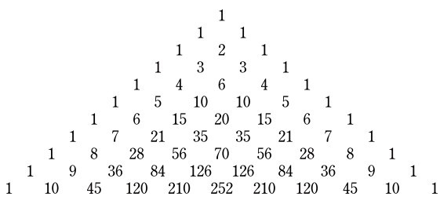
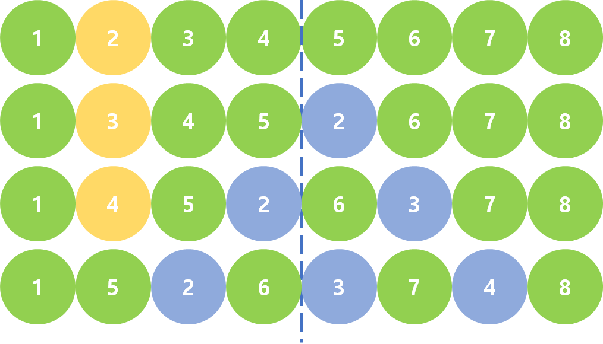
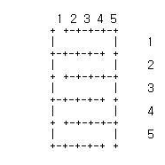
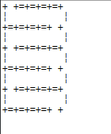

# 기업 입사 문제(홀수)
## 알콜리즘
## 문제1.
**다음과 같은 삼각형 모양으로 수를 배열한 것을 일명 파스칼의 삼각형이라 합니다.  
`높이가 8인 삼각형의 모든 수의 값을 합하면 얼마인지 출력하는 프로그램`을 작성하세요.**
  


### 해결  
파스칼의 삼각형 방식으로 모든 수의 합을 구하게되면  
위에서부터는 `2^0=1, 2^1=2, 2^2=4 ... ` 2의 제곱수로 증가하게 된다. 

def pascalSum(n):
    result=0
    for i in range(n):
        result+=2**i
    print(result)
        
pascalSum(8)

### 결과  
    
255  

--------------------  

## 문제3.
**입력된 숫자 배열을 다음과 같은 형태의 배열로 순서를 변경하는 프로그램을 작성하세요.**
`[a1, a2, a3..., an, b1, b2, b3..., bn]     >>  [a1, b1, a2, b2, a3, b3..., an, bn]`
```
입력: 1 2 3 4 5 6 7 8
출력: 1 5 2 6 3 7 4 8
```
### 해결
입력된 배열을 리스트로하여 그 길이를 절반을 기준으로,  리스트의 1번째 원소를 절반 기준의 오른쪽으로 보았을때 자신의 위치와 같은 곳에 삽입을 하고 자신을 삭제한다. 이후에도 같은 방법으로 삽입, 삭제를 한다.
    

def arraySwitch():
    string=input("입력 :")
    arr=string.split(" ")
    div=int(len(arr)/2)
    for i in range(1,int(len(arr)/2)):
            arr.insert(1+div,arr[1])
            div+=1
            del arr[1]
    print("출력 :",arr)
        
arraySwitch()

### 결과  

입력 :1 2 3 4 5 6 7 8
출력 : ['1', '5', '2', '6', '3', '7', '4', '8']  

--------------------  
## 문제5. 
### 목표 숫자에 맞게 연산하기
**숫자 배열과 목표 숫자가 주어지면, 목표 숫자가 연산 결과로 나올 수 있도록 숫자 배열을 이용한 연산 수식을 출력하는 프로그램을 작성하세요.  
`단, 숫자 배열 사이에 연산자는 덧셈(+)과 뺄셈(-)만 사용가능하며, 배열의 순서는 변경하지 않습니다.`**

```
입력: 1 3 4 5, 7
출력: 1 - 3 + 4 + 5
```
[참고문제] 1부터 9까지의 연속된 수를 `+`나  `-`를 사용하여 합계가 100이 되는 전체 수를 구하시오.
ex) 1 + 2 + 3 - 4 + 5 + 6 + 78 + 9 = 100
[출처](http://codingdojang.com/scode/463)  
### 해결
재귀적인 호출을 사용하여 값의 합이 목표 값에 맞는 연산 순서가 나올 때 까지 수행한다. 스택을 사용하여 정답 출력을 하였다.


arr=input("입력: ")
string=arr.split(",")
number=string[0].split(" ")
obj=int(string[1])
size=len(number)
stack=[]

def recursive(num,index, result):
    if num < 0:
        stack.append(-num)        
    else :stack.append(num)
    result+=num
    index+=1
    if result == obj:
        print(stack)
    elif index < size:
        stack.append('+')
        recursive(int(number[index]),index,result)
        stack.pop()
        stack.append('-')
        recursive(-int(number[index]),index,result)
        stack.pop()
    stack.pop()
    
recursive(int(number[0]),0,0)

### 결과    
입력: 1 3 4 5,7
[1, '-', 3, '+', 4, '+', 5]  

--------------------    
## 문제7. 
### 미로를 만들기
**입력된 숫자 `N`에 대하여 `N*N` 크기의 격자로 된 미로를 만드는 프로그램을 작성하시오. 모든 격자를 통과하는 하나의 경로를 가지고 있어야 하며  
입구는 `(1, 1)`위쪽이며 출구는 `(N, N)`아래 이다. 격자 모서리는 `+`로 표기하며 벽은 `-` 와 `|`를 사용한다.**
```
입력: 5
출력:아래 이미지
```


[참고문제] 높이와 폭의 길이를 입력받아 임의의 미로를 출력하는 프로그램입니다. 미로는 프로그램을 실행할 때마다 다르게 출력되어야 하며 코너는 `+`로, 수직벽은 `|`를 사용하여야 합니다.  
출구는 벽면이 없는 형태로 출력하고, 현재위치는 #으로 표기합니다. 단 현재위치와 출구는 반드시 연결되어야 합니다.

### 해결

public class _7 {
	int n;
	int cornerN;
	int wWallN;
	String corner = "+";
	String wWall = "=";
	String hWall = "|";
	boolean start = true;
	boolean end = false;

	public _7(int n) {
		this.n = n;
		this.cornerN = n + 1;
		this.wWallN = n;

	}
    
	public void sideWall() {
		System.out.print(hWall);
		for (int i = 0; i < wWallN; i++) {
			System.out.print("  ");
		}
		System.out.println(hWall);
	}

	public void upDownWall() {
		int count = wWallN;
		for (int i = 0; i < cornerN; i++) {
			System.out.print(corner);
			if (count != 0) {
				if (i == 0 && start) {
					System.out.print(" ");

				} else if (i == cornerN -2 && end) {
					System.out.print(" ");


				} else {
					System.out.print(wWall);
				}
				count--;
			}

		}
		System.out.println();
		if(start){
			start=false;
			end=true;
		}else if(end){
			end=false;
			start=true;
		}
	}

	public void makeWall() {
		for (int i = 0; i < n; i++) {
			upDownWall();
			sideWall();
		}
		upDownWall();
	}

	public static void main(String[] args) {
		_7 m = new _7(5);
		m.makeWall();

	}
}

### 결과    
  

--------------------    


## 문제9.
### 표 숫자에 맞게 연산하기
**아래 □칸에 두가지 연산자 `(+, -)`만을 넣어 결과가 0인 수식을 만들고자 합니다.**
```
□ 1 □ 6 □ 7 □ 6 □ 1 □ 4 □ 5 = 0
```
**이러한 만족하는 수식을 모두 몇개 만들 수 있을지 출력하는 프로그램을 작성하세요.**
[참고문제] 위의 문제5.  

### 해결  
위의 재귀적으로 푼 문제 5번의 코드를 조금 수정하였다. 5번은 목표 값을 만드는 수식을 정하는 것이지만, 이 문제는 목표 값을 만드는 모든 경우의 수를 세는 것이다. 수식의 앞에도 부호가 들어가야 해서... 야매지만 입력값 배열 첫번째에 `0`을 넣고 시작하게 했다.

number=[0,1,6,7,6,1,4,5]
obj=0
size=len(number)
stack=[]
count=-1

def recursive(num,index, result):
    if num < 0:
        stack.append(-num)        
    else :stack.append(num)
    result+=num
    index+=1
    if result == obj:
        addCount()
    if index<size:
        stack.append('+')
        recursive(number[index],index,result)
        stack.pop()
        stack.append('-')
        recursive(-number[index],index,result)
        stack.pop()
    stack.pop()
def addCount():
    global count
    count+=1
    
    
recursive(number[0],0,0)
print(count)


### 결과    

6
  
--------------------    

## 문제11.(미해결)
### 비트 연산
**Intel CPU 기반에서,  
IEEE 32bit floating point는 Mantissa(Significand) 23bit, Exponent 8bit, Sign 1bit로 표현하며,   
IEEE 16bit floating point는 Mantissa(Significand) 10bit, Exponent 5bit, Sign 1bit로 표현합니다.  
32bit floating point의 Mantissa를 구하는 함수 `unsigned int GetMantissa32(float value)`와  
16bit floating point의 Mantissa를 구하는 함수 `unsigned int GetMantissa16(float value)`를 작성하고**  

**`GetMantissa32(3.14194989) + GetMantissa16(3.14194989)`의 값을 출력하는 프로그램을 작성하세요.**
```
두 함수는 32bit floating point로 입력 받으며, 리턴값은 각각 최대 2^23-1, 2^10-1 입니다.
```


