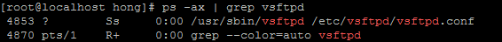
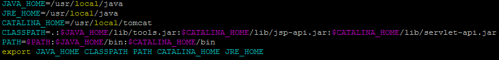
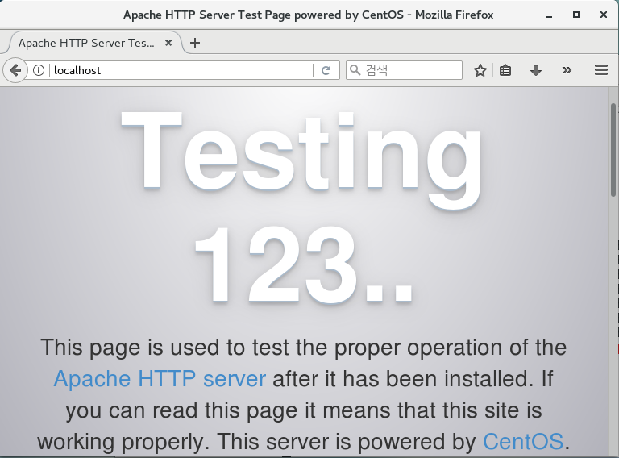
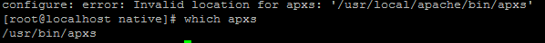
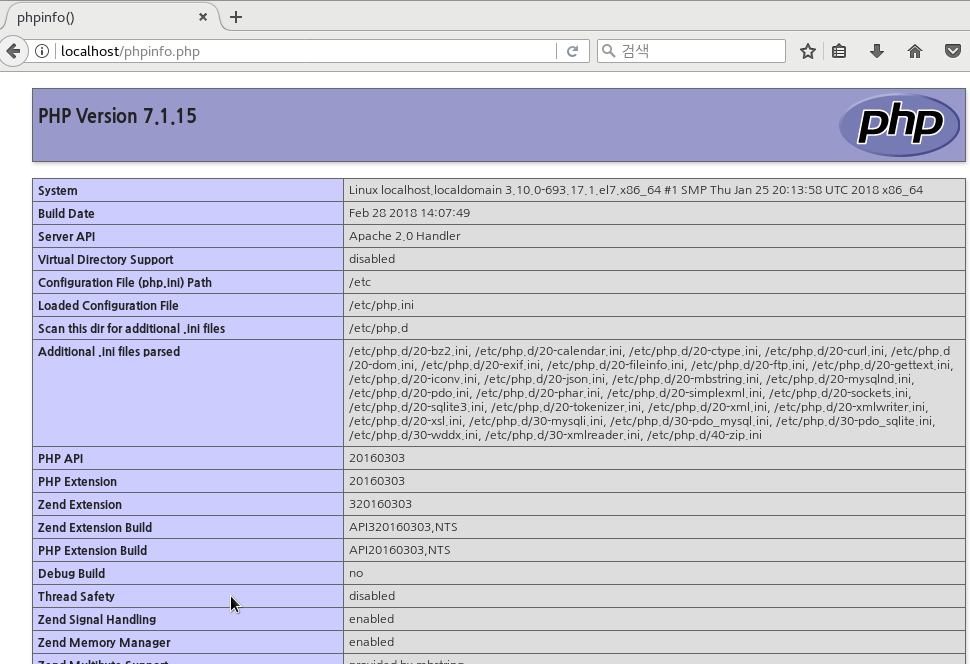
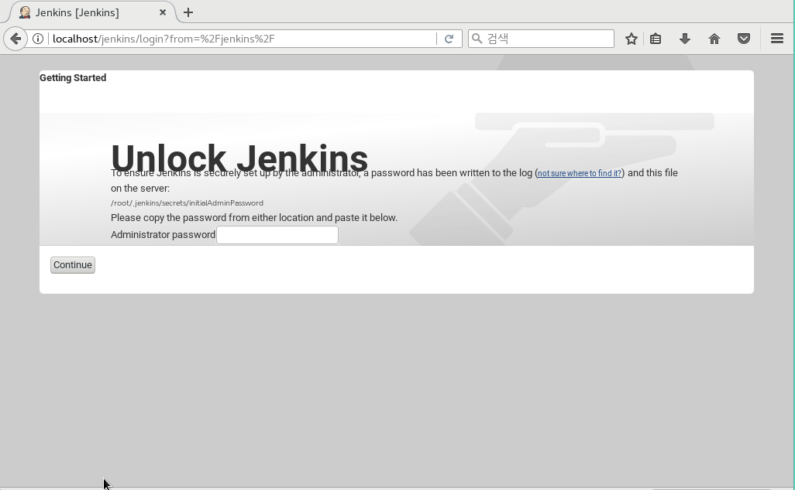
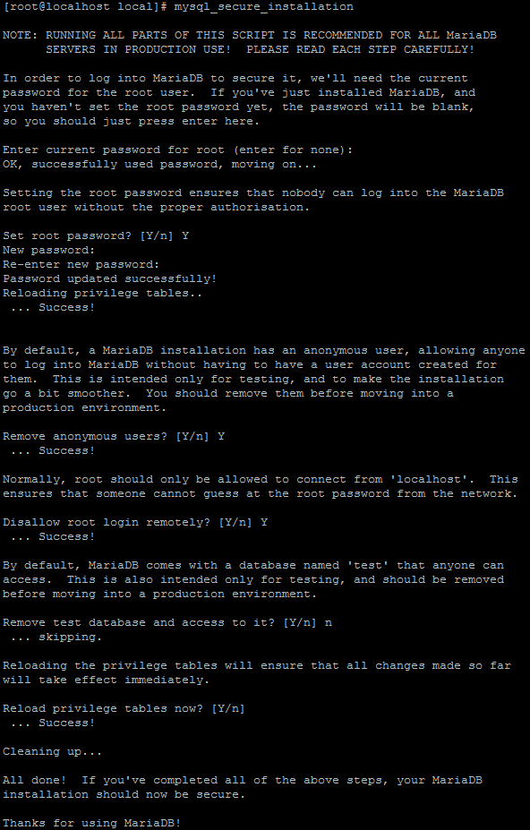

# 환경 구축
```
- OS: CentOs7
- VirtualBox 환경
- Php, Apache, tomcat, MariaDB, java, jenkins, Redmine, SVN Server, FTP Server, Jira

```

- 모든 작업은 sudo 권한을 갖는 계정(root)로 진행
- 에디터를 사용하는데 필요하면 :set nu 로 줄 표시를 한다.
- netstat -tnlp를 사용하여 포트 개방 작업을 할때 체크용으로 쓴다.  

## 1.FTP  

```bash  

yum -y install vsftpd

#vsftpd.conf 파일 수정
vim /etc/vsftpd/vsftpd.conf

#anonymous_enable=YES 를 NO로 변경
#chroot_list_enable=YES
#chroot_list_file 경로
#listen=NO 를 YES로 변경
#listen_ipv6=YES 를 NO로 변경

#vim /etc/vsftpd/chroot_list로 chroot_list 파일 생성하기

vim /etc/vsftpd/chroot_list
	root
	계정명

#방화벽 설정
firewall-cmd --permanent --add-service=ftp
firewall-cmd --permanent --add-port=21/tcp
firewall-cmd --reload
```  

  

```bash
#Selinux 해제하기 방법1.
vim /etc/selinux/config
#SELINUX=enforcing 을 disabled로 변경

#Selinux 해제하기 방법2.
setenforce 0
```

```bash
systemctl enable #vsftpd 부팅시 실행
systemctl restart #vsftpd 서비스 실행
ps -ax | grep vsftpd #구동확인
```

------------------------------------------------
## 2.Java-9.0.4

```bash
cd /usr/local/  #위치 이동

	#만약 기존에 자바가 있다면
	rpm -qa | grep jdk #설치된 리스트 확인
	yum remove java-1.8.0-openjdk* #자바 삭제

wget --no-check-certificate --header "Cookie: oraclelicense=accept-securebackup-cookie" http://download.oracle.com/otn-pub/java/jdk/9.0.4+11/c2514751926b4512b076cc82f959763f/jdk-9.0.4_linux-x64_bin.tar.gz ##자바 다운
tar -xzvf jdk-9.0.4_linux-x64_bin.tar.gz #압축풀기
ln -s jdk-9.0.4/ java #심볼릭 링크 걸기

vim /etc/profie #환경변수 세팅하기 파일 끝에 추가해준다.

	JAVA_HOME=/usr/local/java
	CLASSPATH=.:$JAVA_HOME/lib/tools.jar
	PATH=$PATH:$JAVA_HOME/bin
	export JAVA_HOME CLASSPATH PATH
soucre /etc/profie #환경변수 세팅을 적용하기  
java #자바 확인
javac #자바 확인
```  
  

------------------------------------------------


## 3.톰캣-8.5.28
```bash
cd /usr/local/  #위치 이동
wget http://apache.mirror.cdnetworks.com/tomcat/tomcat-8/v8.5.28/bin/apache-tomcat-8.5.28.tar.gz #다운로드
tar -xvzf apache-tomcat-8.5.28.tar.gz #압축풀기
ln -s /usr/local/apache-tomcat-8.5.28/ tomcat #심볼릭 링크 걸기

vim /etc/profile #환경변수 설정하기 파일 끝에 수정
	JAVA_HOME=/usr/local/java
	JRE_HOME=/usr/local/java
	CATALINA_HOME=/usr/local/tomcat
	CLASSPATH=.:$JAVA_HOME/lib/tools.jar:$CATALINA_HOME/lib/jsp-api.jar:$CATALINA_HOME/lib/servlet-api.jar
	PATH=$PATH:$JAVA_HOME/bin:$CATALINA_HOME/bin
	export JAVA_HOME CLASSPATH PATH CATALINA_HOME JRE_HOME
```

```bash
source /etc/profile #변수 적용시키기
cd tomcat/bin #톰캣의 bin으로 이동
./startup.sh #서비스 실행   or  $./catalina.sh start
./shutdown.sh #!서비스 종료할때
netstat -anp | grep java #8080 포트(톰캣의 본 포트)가 열려 있는 것을 확인
#http://localhost:8080 를 통해 톰캣 실행 확인

firewall-cmd --permanent --zone=public --add-port=8080/tcp #방화벽 8080 포트 해제
firewall-cmd --reload #방화벽 재시작
```
----------------------------------------------
## 4.Apache
```bash
cd /usr/local/  #위치 이동
yum -y install gcc make gcc-c++ pcre-devel #gcc 패키지 설치
yum -y install httpd  #아파치 설치
systemctl enable httpd.service #부팅시 자동시작
systemctl start httpd    # 아파치 서버 시작 = start , 재시작 = restart ,종료 = stop

#http://localhost/ #접속으로 아파치 구동중인 것을 확인
firewall-cmd --permanent --zone=public --add-port=80/tcp #80번포트 방화벽 해제
firewall-cmd --reload #방화벽 재시작
```

아파치 작동을 확인한다.



--------------------------------------------------
## 5.아파치 톰켓 커넥터

톰켓 커넥터 JK를 다운로드한다.
```bash

cd /usr/local/ #위치 이동
wget http://apache.org/dist/tomcat/tomcat-connectors/jk/tomcat-connectors-1.2.42-src.tar.gz # jk다운로드
tar -xzvf tomcat-connectors-1.2.42-src.tar.gz #압축풀기
ln -s tomcat-connect-connectors-1.2.42-src/ connector  #심볼릭링크달기
cd /connector/native   #디렉토리 이동
chmod +x buildconf.sh
./configure --with-apxs=/usr/local/apache/bin/apxs && make && make install # 컴파일 및 인스톨위한 준비
	#configure: error: Invalid location for apxs: '/usr/local/apache/bin/apxs' 라는 에러가 난다면 httpd-devel 설치
	yum -y install httpd-devel #설치
	which apxs #apxs의 위치를 확인하여 경로를 설정해주어 다시 설치한다

  ```


  ```bash
	./configure --with-apxs=/usr/bin/apxs && make && make install #컴파일 및 인스톨

vim /etc/httpd/conf/httpd.conf #아파치 설정하기, 다음 내용을 아래에 추가한다.(/를 눌러 검색모드에 진입한다. n은 next임. LoadMoudle을 찾아 아래에 추가)
	LoadModule jk_module modules/mod_jk.so
	 <VirtualHost *:80>
	     ServerName localhost
	     # 확장자 jsp, json, xml, do를 가진 경로는 woker tomcat으로 연결하는 구문입니다.
	     JkMount /*.jsp tomcat
	     JkMount /*.json tomcat
	     JkMount /*.xml tomcat
	     JkMount /*.do tomcat
	 </VirtuallHost>

	<IfModule mod_jk.c>
	     # 워커 설정파일 위치
	     JkWorkersFile conf/workers.properties
	     # 공유 메모리파일 위치 반드시 Selinux 보안때문에 run에 위치 필수
	     JkShmFile run/mod_jk.shm     # log 위치
	     JkLogFile logs/mod_jk.log     # 로그레벨 설정
	     JkLogLevel info     # 로그 포맷에 사용할 시간 형식을 지정한다.
	     JkLogStampFormat "[%y %m %d %H:%M:%S] "
	</IfModule>

#Apache와 Tomcat Document위치 맞추기 DocumentRoot를 검색하여 Tomcat의 문서 경로로 변경, 경로 접근 권한 추가, index파일 자동화

	DocumentRoot "/usr/local/tomcat/webapps/ROOT"

	<Directory "/usr/local/tomcat/webapps/ROOT">
	    AllowOverride None
	    # Allow open access:
	    Require all granted
	</Directory>

	<IfModule dir_module>
	    DirectoryIndex index.html index.jsp
	</IfModule>
```


```bash

vim /etc/httpd/conf/workers.properties  # mod_jk.conf 파일에서 설정한 워커 설정 파일 만들기
 	 worker.list=tomcat
	 worker.tomcat.port=8009
	 worker.tomcat.host=localhost
	 worker.tomcat.type=ajp13
	 worker.tomcat.lbfactor=1


#http://localhost 로 접속했을때 톰캣 화면이 나오면 연동이 된 것이다 (참고: 권한은 755로 준다 )
```


------------------------------------------

## 6.php-7
```bash

wget -q http://rpms.remirepo.net/enterprise/remi-release-7.rpm #Remi 다운
wget -q https://dl.fedoraproject.org/pub/epel/epel-release-latest-7.noarch.rpm #EPEL 패키지 다운

rpm -Uvh remi-release-7.rpm epel-release-latest-7.noarch.rpm #설치
yum -y --enablerepo=remi-php71 install php php-mysql php-fpm php-mbstring php-xml #설치
yum -y --enablerepo=remi-php71 install zip unzip php-zip #설치

php -v #설치후 버젼을 확인.
vim phpinfo.php  #작성(웹폴더에 /usr/local/tomcat/webapps/ROOT/)한다.
	<?php phpinfo(); ?>

systemctl restart httpd #아파치 재시작후 http://localhost/phpinfo.php 에 접속하여 php 확인

```




------------------
## 7.젠킨스-2.89.4
```bash
cd /usr/local #경로 이동
wget -O /etc/yum.repos.d/jenkins.repo https://pkg.jenkins.io/redhat-stable/jenkins.repo #젠킨스 레포짓 설정파일 생성
rpm --import https://pkg.jenkins.io/redhat-stable/jenkins.io.key #key를 import

yum -y install jenkins   #젠킨스 설치하기


vim /etc/sysconfig/jenkins #포트 변경을 해야 함
	JENKINS_HTTPS_PORT="8080"  #다른 포트와 겹치지 않게 설정  ,8990으로함

systemctl enable jenkins #부팅시 자동 실행하게 설정
```


```bash
systemctl start jenkins #실행하기 실행시에  위와 같은 에러가 있다면
#ln -s /usr/local/jdk-9.0.4/bin/java /usr/bin/java   로 심볼릭 링크를 걸어준 후 다시 실행한다. java 실행파일을 찾게 경로를 다시 맞춰주는 것이다.


#http://localhost:포트 접속해보기

#

cat /var/lib/jenkins/secrets/initialAdminPassword #암호 복사하여 웹페이지에 넣기
```
웹페이지에 나오는 /var/lib/jenkins/secrets/initialAdminPassword에 unlock에 필요한 암호가 들어있다.  

  

암호를 넣게 되면 젠킨스를 커스터마이즈를 할 수 있는 페이지로 넘어간다.  
  

필요한 것들을 설치하면 Admin 유저를 생성하는 페이지로 넘어간다.

  
이렇게 다 끝나면 최종적인 젠킨스 실행 화면이다.  


-------------------------------

## 8.MariaDB-5.5.56
```bash
yum -y install mariadb-server mariadb #마리아디비 설치
systemctl start mariadb.service #마리아디비 서비스 시작
systemctl enable mariadb.service #재부팅시 자동 시작 설정

#초기 보안 설정 명령어
mysql_secure_installation


```
보안 설정을 하는 화면  
처음 설정이기 때문에 root passwd는 공백(enter)


`mysql -uroot -p` 로 접속을 하여 확인
```sql
#접속후
CREATE DATABASE redmine CHARACTER SET utf8 COLLATE utf8_general_ci;  
#레드마인 디비 생성
CREATE USER 'redmine'@'%'IDENTIFIED BY 'hong';  
#레드마인 디비의 유저와 비번 생성  

GRANT ALL PRIVILEGES ON redmine.* TO 'redmine'@'%'; #redmine에게 권한 부여
FLUSH PRIVILEGES; #설정 적용
```  
--------------------------------


