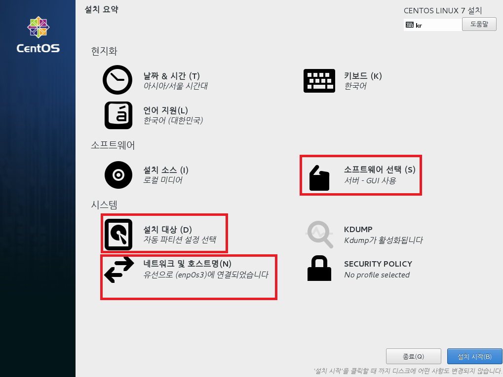
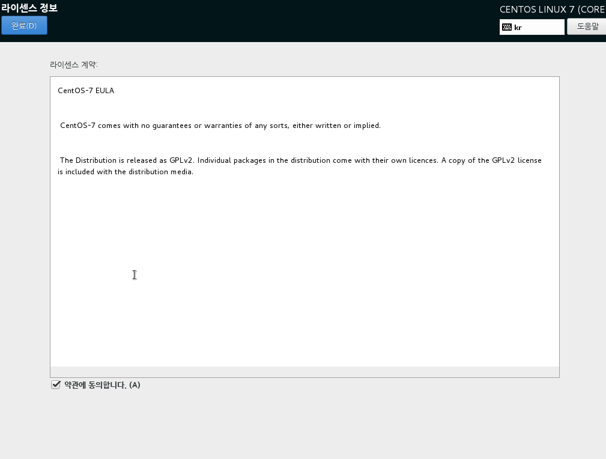
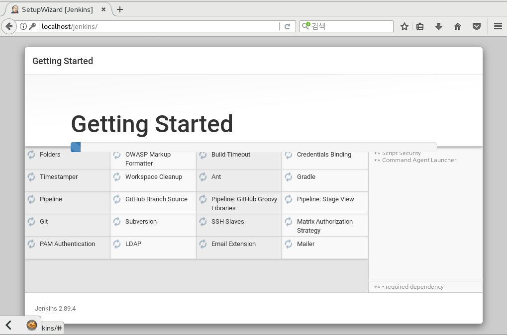
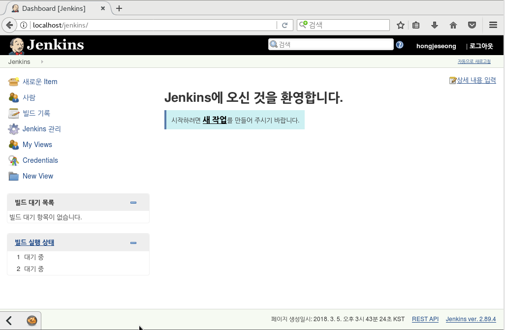
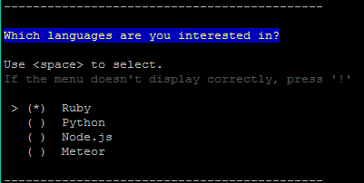
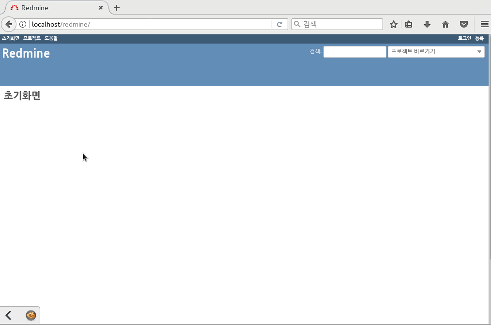

# 환경 구축
```
- OS: CentOs7
- VirtualBox 환경
- Php, Apache, tomcat, MariaDB, java, jenkins, Redmine, SVN Server, FTP Server
```

- 모든 작업은 sudo 권한을 갖는 계정(root)로 진행
- 에디터를 사용하는데 필요하면 :set nu 로 줄 표시를 한다.
- `netstat -tnlp`를 사용하여 포트 개방 작업을 할때 체크용으로 쓴다.    

```bash

yum update -y #업데이트
reboot #재시작하기  

```
## 0.CentOs7 설치

CentOs7 64bit iso 이미지파일을 사용하여 설치를 한다.
  
소프트웨어 선택, 설치 대상, 네트워크 및 호스트명을 설정한다.  
소프트웨어 선택으로 들어가서 서버-Gui사용을 체크한다. 사진의 오른쪽에는 FTP등이 선택 되어있지만 호환성에만 체크해준다.  
  
설치 대상 항목에서는 파티션 설정을 하는 곳이지만 아무것도 하지 않고 완료를 눌러 다시 나온다.  
네트워크 및 호스트명 설정에서는 네트워크 연결상태를 켜는 것으로 설정해준다.  

  

다 설정을 한 다음에 설치시작을 눌러 진행한다. 설치를 하면서 root사용자 설정과 사용자계정을 추가 한다.  

  
아래는 root 사용자 설정 화면이다.  

    
사용자 계정을 추가해준다.
  
후에 라이선스 동의를 해야하는데 gui 사용 약관에 동의를 하고 마무리 설치를 한다.  
  


## 1.FTP  

```bash  

yum -y install vsftpd

#vsftpd.conf 파일 수정
vim /etc/vsftpd/vsftpd.conf

#anonymous_enable=YES 를 NO로 변경
#chroot_list_enable=YES
#chroot_list_file 경로
#listen=NO 를 YES로 변경
#listen_ipv6=YES 를 NO로 변경

#vim /etc/vsftpd/chroot_list로 chroot_list 파일 생성하기

vim /etc/vsftpd/chroot_list
	root
	계정명

#방화벽 설정
firewall-cmd --permanent --add-service=ftp
firewall-cmd --permanent --add-port=21/tcp
firewall-cmd --reload
```  

  

```bash
#Selinux 해제하기 방법1.
vim /etc/selinux/config
#SELINUX=enforcing 을 disabled로 변경

#Selinux 해제하기 방법2.
setenforce 0
```  

  

```bash
systemctl enable #vsftpd 부팅시 실행
systemctl restart #vsftpd 서비스 실행
ps -ax | grep vsftpd #구동확인
```
  

------------------------------------------------  

## 2.Java-1.8.0_131

```bash
cd /usr/local/  #위치 이동

	#만약 기존에 자바가 있다면
	rpm -qa | grep jdk #설치된 리스트 확인
	yum remove java-1.8.0-openjdk* #자바 삭제

	wget --no-cookies --header "Cookie: gpw_e24=xxx; oraclelicense=accept-securebackup-cookie;" "http://download.oracle.com/otn-pub/java/jdk/8u131-b11/d54c1d3a095b4ff2b6607d096fa80163/jdk-8u131-linux-x64.rpm" ##자바rpm다운
	rpm -ivh jdk-8u131-linux-x64.rpm #rpm으로 자바 설치하기

vim /etc/profile #환경변수 세팅하기 파일 끝에 추가해준다.

 JAVA_HOME=/usr/java/jdk1.8.0_131
 JRE_HOME=/usr/java/jdk1.8.0_131
 PATH=$PATH:$JAVA_HOME/bin
 export JAVA_HOME CLASSPATH PATH
source /etc/profile #환경변수 세팅을 적용하기  
java #자바 확인
javac #자바 확인
```  
자바가 정상적으로 설치되고 동작한다.  
자바9버전 환경에서 젠킨스 구동시 오류가 발생하는 이유때문에 자바8버전을 설치해야 한다.


------------------------------------------------


## 3.톰캣-8.5.28
>아래 항목 4.Apache와 구별,웹서버와 웹 컨테이너의 결합으로 다양한 기능을 컨테이너에 구현하여 다양한 역할을 수행할 수 있는 서버를 말한다. 클라이언트의 요청이 있을 때 내부의 프로그램을 통해 결과를 만들어내고 이것을 다시 클라이언트에 전달해주는 역할을 하는 것이 바로 웹 컨테이너 이다

```bash
cd /usr/local/  #위치 이동
wget http://apache.mirror.cdnetworks.com/tomcat/tomcat-8/v8.5.28/bin/apache-tomcat-8.5.28.tar.gz #다운로드
tar -xvzf apache-tomcat-8.5.28.tar.gz #압축풀기
ln -s /usr/local/apache-tomcat-8.5.28/ tomcat #심볼릭 링크 걸기

vim /etc/profile #환경변수 설정하기 파일 끝에 수정
	JAVA_HOME=/usr/java/jdk1.8.0_131
	JRE_HOME=/usr/java/jdk1.8.0_131
	CATALINA_HOME=/usr/local/tomcat
	CLASSPATH=.:$JAVA_HOME/lib/tools.jar:$CATALINA_HOME/lib/jsp-api.jar:$CATALINA_HOME/lib/servlet-api.jar
	PATH=$PATH:$JAVA_HOME/bin:$CATALINA_HOME/bin
	export JAVA_HOME CLASSPATH PATH CATALINA_HOME JRE_HOME
```

```bash
source /etc/profile #변수 적용시키기
cd tomcat/bin #톰캣의 bin으로 이동
./startup.sh #서비스 실행   or  $./catalina.sh start
./shutdown.sh #!서비스 종료할때
netstat -anp | grep java #8080 포트(톰캣의 본 포트)가 열려 있는 것을 확인
#http://localhost:8080 를 통해 톰캣 실행 확인

firewall-cmd --permanent --zone=public --add-port=8080/tcp #방화벽 8080 포트 해제
firewall-cmd --reload #방화벽 재시작
```
----------------------------------------------
## 4.Apache
```bash
cd /usr/local/  #위치 이동
yum -y install gcc make gcc-c++ pcre-devel #gcc 패키지 설치
yum -y install httpd  #아파치 설치
systemctl enable httpd.service #부팅시 자동시작
systemctl start httpd    # 아파치 서버 시작 = start , 재시작 = restart ,종료 = stop

#http://localhost/ #접속으로 아파치 구동중인 것을 확인
firewall-cmd --permanent --zone=public --add-port=80/tcp #80번포트 방화벽 해제
firewall-cmd --reload #방화벽 재시작
```

아파치 작동을 확인한다.


--------------------------------------------------
## 5.아파치 톰켓 커넥터

톰켓 커넥터 JK를 다운로드한다.
```bash

cd /usr/local/ #위치 이동
wget http://apache.org/dist/tomcat/tomcat-connectors/jk/tomcat-connectors-1.2.42-src.tar.gz # jk다운로드
tar -xzvf tomcat-connectors-1.2.42-src.tar.gz #압축풀기
ln -s tomcat-connect-connectors-1.2.42-src/ connector  #심볼릭링크달기
cd /connector/native   #디렉토리 이동
chmod +x buildconf.sh
./configure --with-apxs=/usr/local/apache/bin/apxs && make && make install # 컴파일 및 인스톨위한 준비
	#configure: error: Invalid location for apxs: '/usr/local/apache/bin/apxs' 라는 에러가 난다면 httpd-devel 설치
	yum -y install httpd-devel #설치
	which apxs #apxs의 위치를 확인하여 경로를 설정해주어 다시 설치한다

  ```


  ```bash
	./configure --with-apxs=/usr/bin/apxs && make && make install #컴파일 및 인스톨

vim /etc/httpd/conf/httpd.conf #아파치 설정하기, 다음 내용을 아래에 추가한다.(/를 눌러 검색모드에 진입한다. n은 next임. LoadMoudle을 찾아 아래에 추가)
	LoadModule jk_module modules/mod_jk.so
	 <VirtualHost *:80>
	     ServerName localhost
	     # 확장자 jsp, json, xml, do를 가진 경로는 woker tomcat으로 연결하는 구문입니다.
	     JkMount /*.jsp tomcat
	     JkMount /*.json tomcat
	     JkMount /*.xml tomcat
	     JkMount /*.do tomcat
	 </VirtuallHost>

	<IfModule mod_jk.c>
	     # 워커 설정파일 위치
	     JkWorkersFile conf/workers.properties
	     # 공유 메모리파일 위치 반드시 Selinux 보안때문에 run에 위치 필수
	     JkShmFile run/mod_jk.shm     # log 위치
	     JkLogFile logs/mod_jk.log     # 로그레벨 설정
	     JkLogLevel info     # 로그 포맷에 사용할 시간 형식을 지정한다.
	     JkLogStampFormat "[%y %m %d %H:%M:%S] "
	</IfModule>

#Apache와 Tomcat Document위치 맞추기 DocumentRoot를 검색하여 Tomcat의 문서 경로로 변경, 경로 접근 권한 추가, index파일 자동화

	DocumentRoot "/usr/local/tomcat/webapps/ROOT"

	<Directory "/usr/local/tomcat/webapps/ROOT">
	    AllowOverride None
	    # Allow open access:
	    Require all granted
	</Directory>

	<IfModule dir_module>
	    DirectoryIndex index.html index.jsp
	</IfModule>
```


```bash

vim /etc/httpd/conf/workers.properties  # mod_jk.conf 파일에서 설정한 워커 설정 파일 만들기
 	 worker.list=tomcat
	 worker.tomcat.port=8009
	 worker.tomcat.host=localhost
	 worker.tomcat.type=ajp13
	 worker.tomcat.lbfactor=1


#http://localhost 로 접속했을때 톰캣 화면이 나오면 연동이 된 것이다 (참고: 권한은 755로 준다 )
```


------------------------------------------

## 6.php-7
```bash

wget -q http://rpms.remirepo.net/enterprise/remi-release-7.rpm #Remi 다운
wget -q https://dl.fedoraproject.org/pub/epel/epel-release-latest-7.noarch.rpm #EPEL 패키지 다운

rpm -Uvh remi-release-7.rpm epel-release-latest-7.noarch.rpm #설치
yum -y --enablerepo=remi-php71 install php php-mysql php-fpm php-mbstring php-xml #설치
yum -y --enablerepo=remi-php71 install zip unzip php-zip #설치

php -v #설치후 버젼을 확인.
vim phpinfo.php  #작성(웹폴더에 /usr/local/tomcat/webapps/ROOT/)한다.
	<?php phpinfo(); ?>

systemctl restart httpd #아파치 재시작후 http://localhost/phpinfo.php 에 접속하여 php 확인

```


------------------
## 7.젠킨스-2.89.4
```bash
cd /usr/local/tomcat/webapps #경로 이동
wget http://mirrors.jenkins.io/war-stable/latest/jenkins.war #젠킨스 war 다운로드  
#war파일을 톰캣에서  구동하기때문에
#webapps 폴더 아래에 위치시킨다.

#아파치의 설정파일에 삽입하기 (server.xml)
vim /etc/httpd/conf/httpd.conf
	<VirtualHost *:80>
             ServerName localhost
             JkMount /*.jsp tomcat
             JkMount /*.json tomcat
             JkMount /*.xml tomcat
             JkMount /*.do tomcat
	   # 이 밑에 아래 내용을 추가 한다.

	 ProxyPass /jenkins http://127.0.0.1:8080/jenkins
	 ProxyPassReverse /jenkins http://127.0.0.1:8080/jenkins

#톰캣을 재부팅하고 http://localhost/jenkins로 접속
#웹페이지에 나오는 /root/.jenkins/secrets/initialAdminPassword에 unlock에 필요한 암호가 들어있다

cat /root/.jenkins/secrets/initialAdminPassword #암호 복사하여 웹페이지에 넣기
```  

  

암호를 넣게 되면 젠킨스를 커스터마이즈를 할 수 있는 페이지로 넘어간다.  
  

필요한 것들을 설치하면 Admin 유저를 생성하는 페이지로 넘어간다.

  
이렇게 다 끝나면 최종적인 젠킨스 실행 화면이다.  


-------------------------------

## 8.MariaDB-5.5.56
```bash
yum -y install mariadb-server mariadb #마리아디비 설치
systemctl start mariadb.service #마리아디비 서비스 시작
systemctl enable mariadb.service #재부팅시 자동 시작 설정

#초기 보안 설정 명령어
mysql_secure_installation


```
보안 설정을 하는 화면  
처음 설정이기 때문에 root passwd는 공백(enter)


`mysql -uroot -p` 로 접속을 하여 확인
```sql
#접속후
CREATE DATABASE redmine CHARACTER SET utf8 COLLATE utf8_general_ci;  
#레드마인 디비 생성
CREATE USER 'redmine'@'%'IDENTIFIED BY 'hong';  
#레드마인 디비의 유저와 비번 생성  

GRANT ALL PRIVILEGES ON redmine.* TO 'redmine'@'%'; #redmine에게 권한 부여
FLUSH PRIVILEGES; #설정 적용
```  
--------------------------------

## 9.레드마인-3.4.4  

레드마인 의존 라이브러리 설치하기
```bash
yum -y install gcc g++ cpp gcc-c++
yum -y install openssl-devel readline-devel zlib-devel curl-devel libyaml-devel
yum -y install mariadb-devel
yum -y install ImageMagick ImageMagick-devel

#Ruby 설치하기 레드마인은 루비로 되어 있으므로 설치한다.

cd /usr/local #경로 이동

wget http://cache.ruby-lang.org/pub/ruby/ruby-2.5.0.tar.gz #루비 압축파일 다운로드  ! 2.2.2 이상의 버젼을 써야한다.
tar -zxvf ruby-2.5.0.tar.gz #압축풀기
ln -s /usr/local/ruby-2.5.0 /usr/local/ruby #심볼릭 링크 설정
cd ruby #경로이동

./configure --disable-install-doc
make && make install #컴파일 진행하기
ln -s /usr/local/ruby-2.5.0/ruby /usr/bin/ruby
ruby -v #루비 버젼 확인하기


cd /usr/local #경로 이동하기
wget https://rubygems.org/rubygems/rubygems-2.7.6.tgz #루비잼 다운로드
tar -zxvf rubygems-2.7.6.tgz #루비잼 압축풀기
ln -s rubygems-2.7.6 rubygems #심볼릭 링크 설정
cd rubygems #rubygems로 이동
ruby setup.rb #rubygems 설치하기
bin/gem install rails -V #레일 설치
bin/gem install bundler -no-rdoc --no-ri #gem으로 번들러 설치

cd /usr/local/tomcat/webapps/ROOT/ #경로 이동
wget http://www.redmine.org/releases/redmine-3.4.4.tar.gz #레드마인 압축파일 다운로드
tar -xzvf redmine-3.4.4.tar.gz #압축해제

mv redmine-3.4.4 redmine #압축해제된 레드마인폴더 이름 바꾸기
cd redmine #경로 이동
cp ./config/database.yml.example config/database.yml #설정파일 구성하기
vim ./config/database.yml #DB, 계정 설정하기 production만  
```  
  


```bash
bundle install --without development test  #패키지를 설치함
bundle exec rake generate_secret_token #세션변조 방지 Key 생성하기.
bundle exec rake db:migrate RAILS_ENV=production # 디비 스키마 설정
bundle exec rake redmine:load_default_data RAILS_ENV=production REDMINE_LANG=ko  #언어:한국어 설정하기
```  
---------------------------------------  
## 10.레드마인+아파치 연동 모듈 설치하기  

```bash
cd /usr/local/rubygems/ #루비잼으로 이동

bin/gem install passenger  #연동 모듈 설치하기
passenger-install-apache2-module  #설치후 이 명령어로 설치를 진행할 수 있다.
	enter입력
	느낌표 입력후 루비로 설정해주고 enter
```  
  
  
```bash
	#r사진을 보면 설정파일에 코드를 추가하라고 하는 것을 볼 수 있다.
   LoadModule passenger_module /usr/local/lib/ruby/gems/2.5.0/gems/passenger-5.2.1/buildout/apache2/mod_passenger.so
   <IfModule mod_passenger.c>
     PassengerRoot /usr/local/lib/ruby/gems/2.5.0/gems/passenger-5.2.1
     PassengerDefaultRuby /usr/local/bin/ruby
   </IfModule>  

```  


  

```bash


#redmine/public을 웹서비스 폴더에서 사용 가능하도록 링킹을 걸고, apache 권한을 줘야한다.
ln -s /usr/local/tomcat/webapps/ROOT/redmine/public /usr/local/tomcat/webapps/ROOT/redmine
chown -R apache. /usr/local/tomcat/webapps/ROOT/redmine/


vim /etc/httpd/conf/httpd.conf                #위에서 복사해 놓은 코드를 추가한다

	(맨아래에 추가)
	LoadModule passenger_module /usr/local/lib/ruby/gems/2.5.0/gems/passenger-5.2.1/buildout/apache2/mod_passenger.so
   	<IfModule mod_passenger.c>
	     PassengerRoot /usr/local/lib/ruby/gems/2.5.0/gems/passenger-5.2.1
	     PassengerDefaultRuby /usr/local/bin/ruby
	   </IfModule>

	<Directory "/usr/local/tomcat/webapps/ROOT/redmine">
		Require all granted
		Options FollowSymLinks
		AllowOverride None
		RailsBaseURI /redmine

	</Directory>


systemctl restart httpd #웹서비스 재시작하기
```
http://localhost/redmineweb 에 접속하여 레드마인을 확인한다.
초기 ID/PW는 admin/admin이다.  

     

------------------------

## 11.Subversion- 1.7.14

```bash
cd /usr/local/ #경로 이동
yum -y install subversion #Subversion 설치하기

mkdir svn #svn 폴더만들기
cd svn # svn폴더로 이동
mkdir repo #저장소로 사용할 폴더 만들기
cd repo #생성한 저장소로 이동하기
svnadmin create --fs-type fsfs devl   #devl은 저장소명이다 이렇게 하면 devl이라는 저장소가 생긴다

#설정 파일 생성하기 service 명령어로 svn을 서비스 시작/종료를 가능하게 한다
#이전에 만든 저장소의 상위폴더의 위치를 적어 파일 생성한다(devl 저장소의 상위 폴더는 /usr/local/svn/repo)
echo 'OPTION="--threads --root /usr/local/svn/repo"' > /etc/sysconfig/svnserve
cat /etc/sysconfig/svnserve #파일의 내용을 확인해본다
```

       

```bash
cd devl/conf #위치 이동, devl 폴더안의 svnserve.conf 파일을 수정할 것이다.
mv svnserve.conf svnserve.conf.bak #수정하기 전에 파일을 미리 백업하기
echo '[general]
 anon-access = none
 auth-access = write
 password-db = passwd
 authz-db = authz' > svnserve.conf

cat svnserve.conf #잘 수정했는지 확인하기


#계정설정하기
mv passwd passwd.bak
echo '[users]
 svnuser1 = svnpasswd1
 svnuser2 = svnpasswd2' > passwd
cat passwd #잘 작성했는지 확인하기

#권한관련 에러는 conf/authz 파일의 아래에 계정 권한을 추가하면 된다.


service svnserve start #서비스 시작하기,   systemctl start svnserve로도 가능
ps -ef | grep svnserve | grep -v grep #svn 이 돌아가는 것을 볼 수 있다
netstat -anp | grep svnserve #svn 서버가 돌아가는데 기본포트는 3690이다, 실행 되는 것을 볼 수 있다
systemctl enable svnserve #재부팅시 자동 시작하게 설정
```

   

