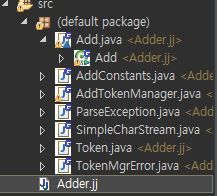

# Compiler[컴파일러], 덧셈기능

_오토마타 이론 공부 필요(추가)_

### C♭에서 삭제된 기능


- 전처리기능
- 구조체 등
- 부동소수점수
- K&R문법
- 등등...


### 토큰  

프로그래밍 언어 처리에서 **의미가 있는 값**을 **토큰(token)** 이라 한다.


### BNF 
##### Backus–Naur form, Backus normal form


정의할때 (알파벳을 정의 ex)  
`<ALPHABAT> := "a"|"b"|"c" . . . .|"z"|`  
  
`<ALPHABAT> := "a-z"`  

`<ALPHABAT> := "a"`  

`<ALPHABAT> := "!" [a-z]*`   

(또 다른 ex)  

`<digit> ::= "0" | "1" | "2" | "3" | "4" | "5" | "6" | "7" | "8" | "9"`  

`<letter> ::= "A" | "B" | "C" | "D" | "E" | "F"`  

`<number> ::= <digit> | <letter>`  

`<integer> ::= <number> | <number><integer>`  

`*`는 0~무한대, `+`는 1~무한대  즉 `*`일 경우 0개인 경우가 나올 수 있고, `+`인경우 1개 이상이 나온다는 의미이다.  

`<sum>:=<number><plus><number><equal>`  

- 한번 정의하여 사용하는 경우에는, 재사용성과 사람이 해석하기에 편하다.


-----------------------------  


## JavaCC

### JavaCC install plugin  


- JavaCC의 대략적인 문법구조  

```java
options {

JavaCC 옵션

}

 

PARSER_BEGIN(파서 클래스명)

package 패키지명;

import 라이브러리명;

 

public class 파서클래스명 {

java 코드

}

PARSER_END(파서클래스명)

 

스캐너 작성

 

파서 작성
```  

eclipse 메뉴에서  
- [help] > [Install New Software]
- 새로운 창에서 [add] 를 선택
- Name : JavaCC Plug-In, Location : http://eclipse-javacc.sourceforge.net/ 내용을 입력후 확인하여 설치를 진행한다
-  새로운 프로젝트를 만들고 Adder.jj 파일을 생성한다  

[소스코드-정수 덧셈하기]
```java
PARSER_BEGIN(Add) 

 

import java.io.*;

 

class Add {

 public static void main(String[] args) {

  for(String arg : args) {

   try {

    System.out.println(eval(arg));

   } catch (ParseException e) {

    System.err.println(e.getMessage());

   }

  }

 }

 

 public static long eval(String state) throws ParseException {

  Reader reader = new StringReader(state);

  try {

   return new Add(reader).exp();

  } finally {

   try { reader.close(); } catch(Exception e) {}

  }

 }

}
PARSER_END(Add)

SKIP: { <[" ", "\t", "\r", "\n"]> } 

TOKEN: {

        <INTEGER:(["0"-"9"])+>

}

long exp():

{ 

        Token x, y;

}

{

      x=<INTEGER> "+" y=<INTEGER> <EOF>

{

return Long.parseLong(x.image) + Long.parseLong(y.image);

}

}
```  
```
- Options에서는 Static 옵션을 false로 지정한다.
  이 옵션을 true로 하면 javaCC가 생성하는 모든 멤버와 method가 static method가 되므로 주의  

- PARSER_BEGIN(Adder) ~PARSER_END(Adder) 까지 파서 클래스를 정의할 수 있으나
  이번에는 Adder 클래스 안에서만 사용이 가능하게 하기 위해 main을 사용함  

- SKIP(공백, 탭, 줄바꿈 등의 불필요한 토큰 건너뛰기)과 TOKEN(정수 리터럴 정의)으로 스캐너를 정의  

- Long expr에서 끝까지가 협의의 파서를 정의하는 부분. (토큰 해석과 동작을 정의)  

-Cbc에서는 추상 구문 트리를 만들지만 adder 클래스에서는 바로 식의 결과를 계산하는 차이점이 있다.

```


- Adder.jj 파일을 compile with javacc 로 컴파일 한다
- 컴파일이 정상으로 되면 Add.java 및 보조 클래스들이 생김  


- Add.java를 인자값과 함께 실행하면 덧셈 결과가 나온다


