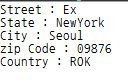

# Compiler[컴파일러], 단어 스캔

### 토큰(Token)


#### 식별자와 예약어의 스캔
```Java
TOKEN:{
  <VOID : "void">
  | <CHAR : "char">
  | <SHORT : "short">
  | <INT : "int">
  | <LONG : "long">
  | <ENUM : "enum">
  | <STATIC : "static">
  | <IF : "if">
  | <ELSE : "else">
  | <SWITCH : "switch">
  //등등등
}
TOKEN : {
  <IDENTIFIER : ["a"-"z","A"-"Z","_"](["a"-"z","A"-"Z","_","0"-"9"])*>
}

```
- 제일 처음에 있는 TOKEN 명령은 `예약어(reserved word)` 규칙
- 두 번째 TOKEN 명령은 `식별자` 규칙

#### 매칭 규칙 선택
소스 코드에 ‘voidFunction’이라고 쓰여져 있었다면 어떤 토큰이 생성될까?  
IDENTIFIER 토큰을 생성?
앞의 ‘void’ 부분은 VOID 토큰의 정규 표현에도 일치하므로 VOID 토큰이 생성?  

  JavaCC에서는 작성된 정규 표현을 모두 테스트해 보고 **나서 가장 긴 문자열에 일치하는 규칙** 을 선택하기 때문이다.  
  `voidFunction`에서 VOID 토큰의 정규 표현에 일치하는 부분은 `void` 4문자 뿐.  
  IDENTIFIER 토큰의 정규 표현은 ‘voidFunction’ 12문자와 일치하며 12문자 쪽이 더 길기 때문에 JavaCC는 ‘voidFunction’에 해당하는 `IDENTIFIER` 토큰을   생성한다.  


#### 수치 스캔
  ```
  ["1"-"9"] - 0을 제외한 숫자 1문자
  ["0"-"9"] - 임의의 숫자 1문자
  (["0"-"9"])* - 임의의 숫자 중, 0문자 이상을 나열
  ("U")? - 생략 가능한 문자 "U"
  ("L")? - 생략 가능한 문자 "L"
  ["x", "X"] - 문자 "x" 또는 문자 "X"
  ["0"-"9", "a"-"f", "A"-"F"]
  임의의 숫자 또는 a~f, A~F 중 1문자(16진수 문자)
  (["0"-"9", "a"-"f", "A"-"F"])+ - 16진수 문자 중 1문자 이상을 나열
  ["0"-"7"] - 0에서 7 중에서 1문자(8진수 문자)
  (["0"-"7"])* - 8진수 문자 중, 0문자 이상을 나열

  ```  

#### 공백 스킵
```java
SPECIAL_TOKEN: { <SPACES: ([" ", "\t", "\n", "\r", "\f"])+> }  

```
`[" ", "\t", "\n", "\r", "\f "]`는
- " "(공백 문자)
-  "\t"(탭)
- "\n"(줄   바꿈)
- "\r"(복귀)
- "\f "(다음 페이지)
이 중에서 문자 하나를 나타내므로, ‘+’를 붙이면 위 5개의 문자 중 1문자 이상을 나열하는 문자열

#### 블록 코멘트 스킵  

```java

MORE: {<"/*"> : IN_BLOCK_COMMENT}
<IN_BLOCK_COMMENT> MORE: { ~[]>}
<IN_BLOCK_COMMENT>  SPECIAL_TOKEN: {<BLOCK_COMMENT: "*/"> DEFAULT}
```


### 문자열 입력 받기

거리이름, 시, 주, zipcode, 국가를 argument로 넣기  

```java
options {

   STATIC = false;

}
PARSER_BEGIN(getStr)


import java.io.*;


class getStr {

 public static void main(String[] args) {

  for(String arg : args) {

   try {

    System.out.println(eval(arg));

   } catch (ParseException e) {

    System.err.println(e.getMessage());

   }

  }

 }


 public static String eval(String state) throws ParseException {

  Reader reader = new StringReader(state);

  try {

   return new getStr(reader).exp();

  } finally {

   try { reader.close(); } catch(Exception e) {}

  }

 }

}
PARSER_END(getStr)

SKIP: { <["\t", "\r", "\n"]> }

TOKEN: {

        <IDENTIFIER: (["a"-"z", "A"-"Z"])+>
      | <NUMBER: (["0"-"9"])+>
      | <SPLIT: (["_"]) >

}

String exp():

{

        Token street, city, state, zipCode, country;
        String streetS="Street : ";
        String cityS="City : ";
        String stateS="State : ";
        String zipCodeS="zip Code : ";
        String countryS="Country : ";

}

{
street=<IDENTIFIER > <SPLIT > city=<IDENTIFIER > <SPLIT > state=< IDENTIFIER > <SPLIT > zipCode=< NUMBER > <SPLIT > country=< IDENTIFIER > <EOF>

{
streetS=streetS+street.image;
stateS=stateS+state.image;
cityS=cityS+city.image;
zipCodeS=zipCodeS+zipCode.image;
countryS=countryS+country.image;
return streetS+"\n"+stateS+"\n"+cityS+"\n"+zipCodeS+"\n"+countryS;

}

}

```



