# Project Manage System 환경구축 (ver. Linux USB , Compile install)
### 구성
```
- CentOS7
- php
- apache
- tomcat
- redmine
- jenkins
- Subversion
- MySQL
- ruby
- rubygems
- Graphviz
- SourceNavigator.....
```
**설치는 root 계정으로 진행 하였음**

---------------------------------------
# USB Install
## 1. CentOS7 OS 초기 설치
### 언어설정  

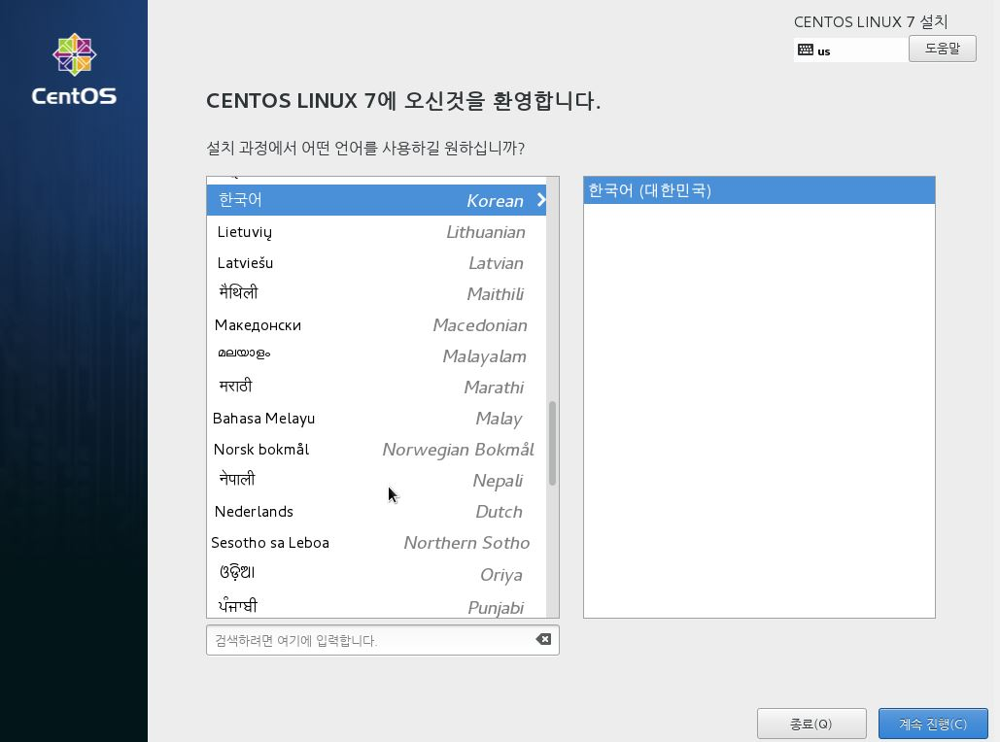
한국어로 설정
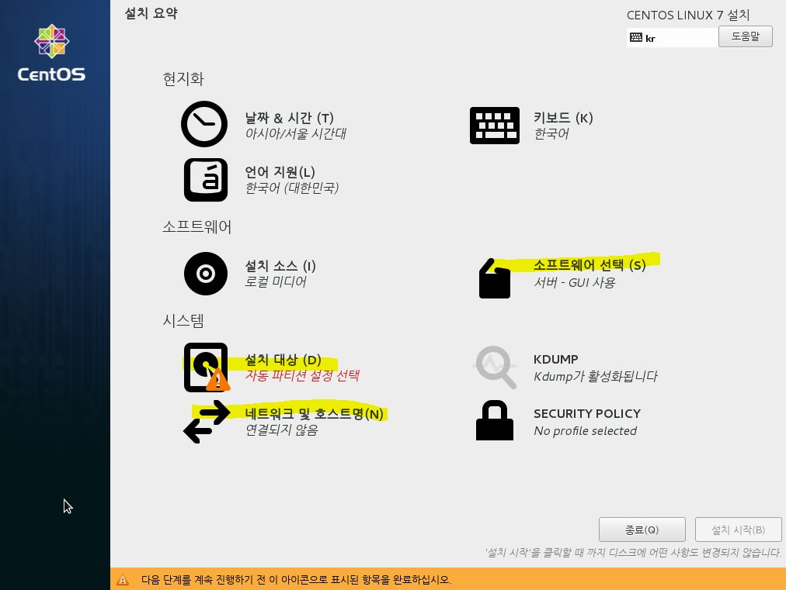  
 아래 3가지를 설정한다.
- 소프트웨어 선택
- 설치 대상
- 네트워크 및 호스트명

**소트프웨어 선택**  

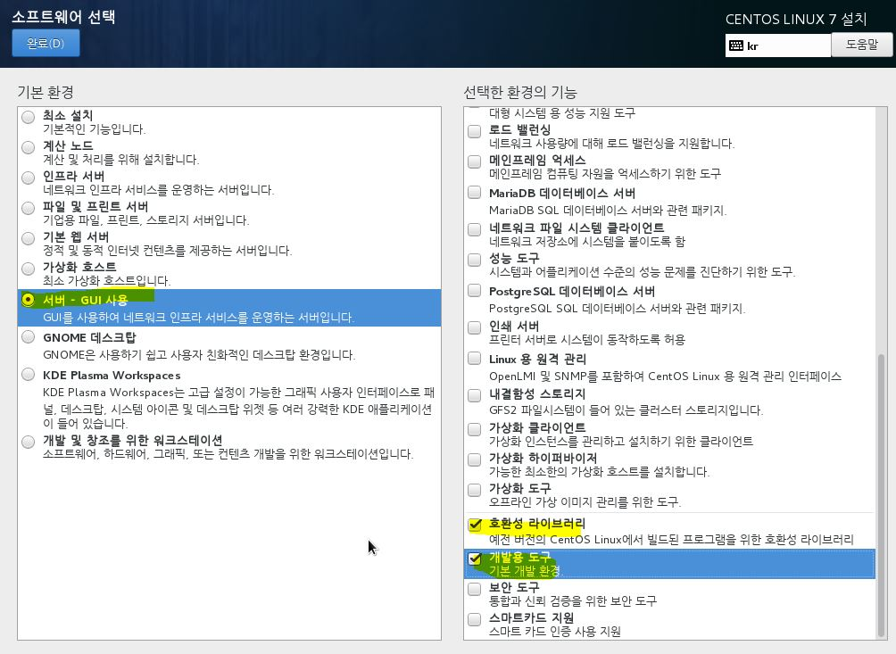

**설치 대상**
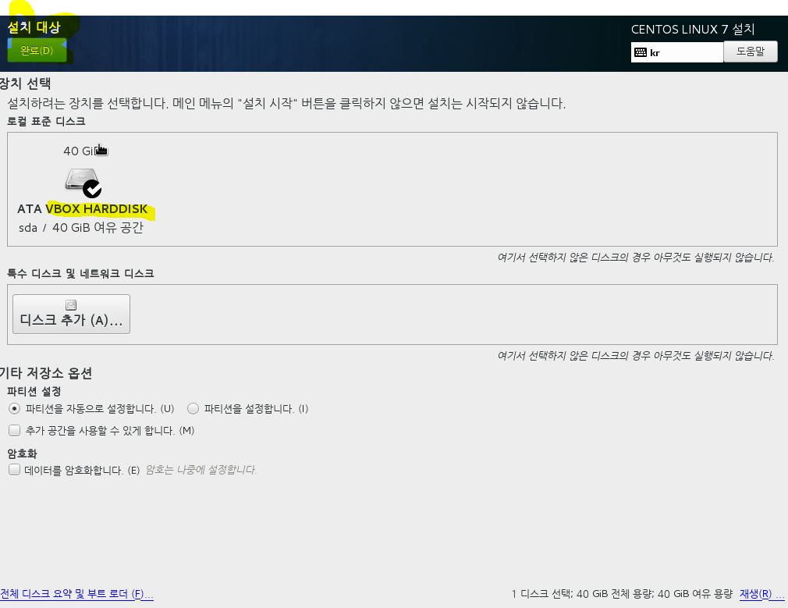   

 vm환경에서 테스트 작업한 것이라 따로 파티션 설정을 하진 않았습니다.  

 **네트워크 및 호스트명**

 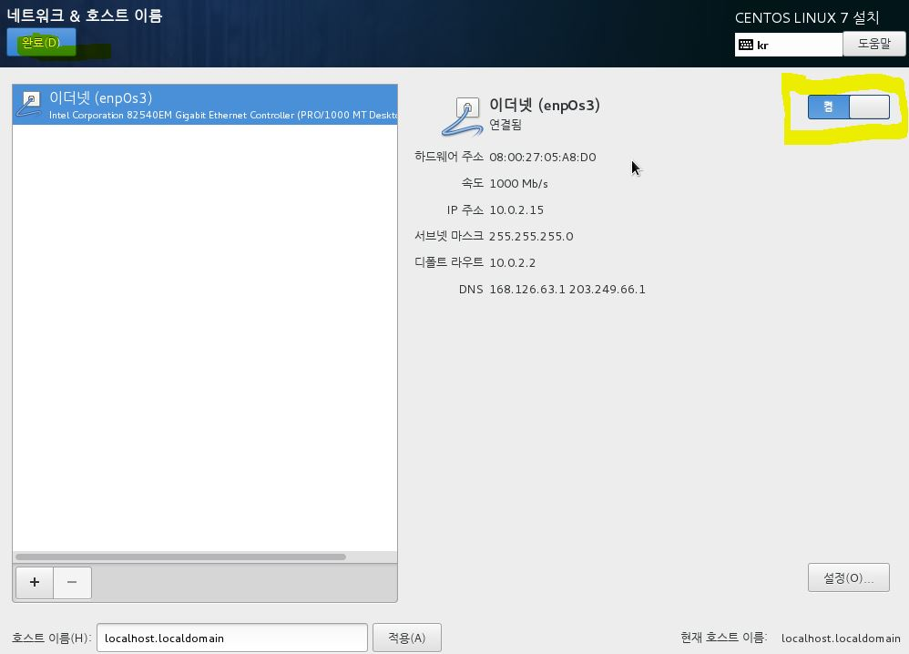
이더넷 연결을 켬으로 바꾸어 줍니다.  
설치 시작을 누르면 사용자 설정으로 넘어갑니다.


 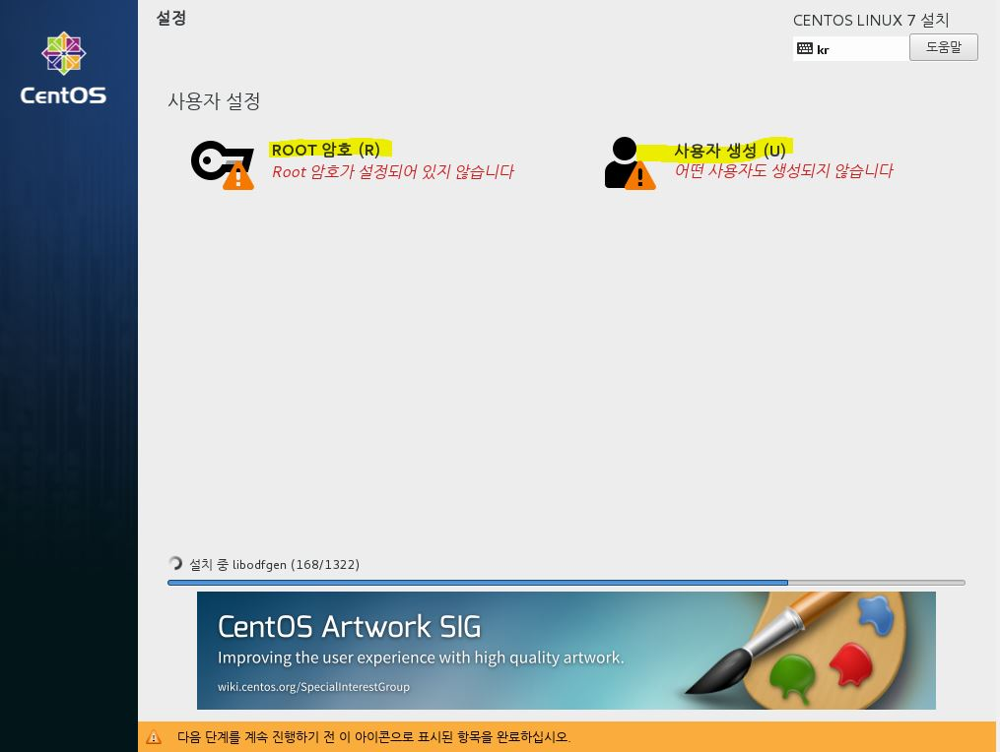
 OS가 설치되는 중에 root 암호와, 사용자를 생성하며 완료 후 재부팅을 합니다.  

 재부팅이 되면 라이센스 동의 목록을 체크한 후 os 설정을 완료합니다.
# 2. USB 설치
SWVpack.tar.gz를 사용하여 설치.  
usb파일 옮기기
```sh
fdisk -l #인식된 usb를 리스트로 보여준다 예) /dev/sda1
mkdir /tmp/usb #usb를 마운트할 폴더를 만든다
mount /dev/sda1 /tmp/usb #만든 폴더에 마운트하기
## 사용이 끝났을경우
umount /dev/sda1 #언마운트 하기
```
**usb 마운트 한 폴더 안의  SWVpack.tar.gz 를 `/usr/local` 경로에 옮깁니다.**

```sh
mv /tmp/usb/SWVpack.tar.gz /usr/local #file 옮기기
tar zxvpf SWVpack.tar.gz #압축 해제  ->SWVpack 폴더가 생긴다.
cd SWVpack #SWVpack으로 이동
./init.sh #파일 실행 -> /usr/local/SWV 폴더 생성
```
- (참고)CentOS7 기본 OpenSSL의 버전은 1.0.1 입니다. init.sh 파일을 실행하면 1.0.2 버전으로 업데이트가 됩니다.

**Start**  

SWV폴더안에 start.sh 파일 실행으로 apache, mysql, tomcat 을 구동합니다.
```sh
cd /usr/local/SWV/ #SWV 폴더로 이동
./start.sh  # 구동시키기
```

# Jenkins 실행
 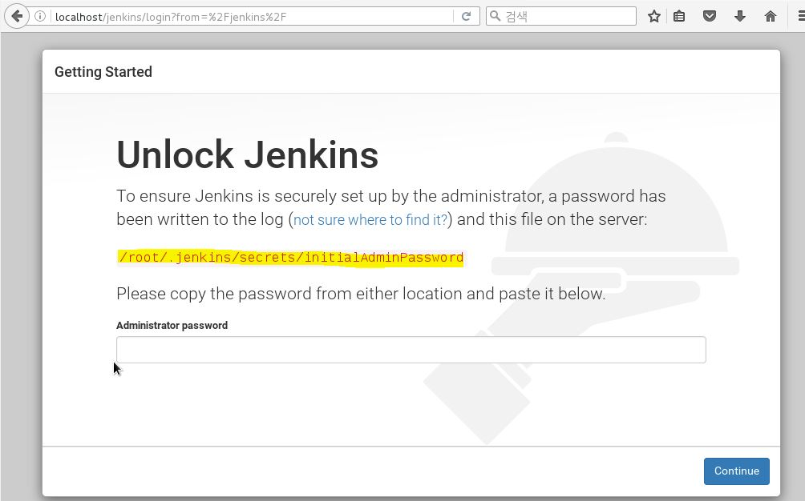
 localhost/jenkins로 접속을 하면 초기에 걸린 Lock을 풀어주기 위해 위에서 나오는 파일의 내용을 넣어줘야 합니다.
 ```sh
 cat /root/.jenkins/secrets/initailAdminPassword  #나오는 비밀번호를 복사하여 넣습니다.
 ```
 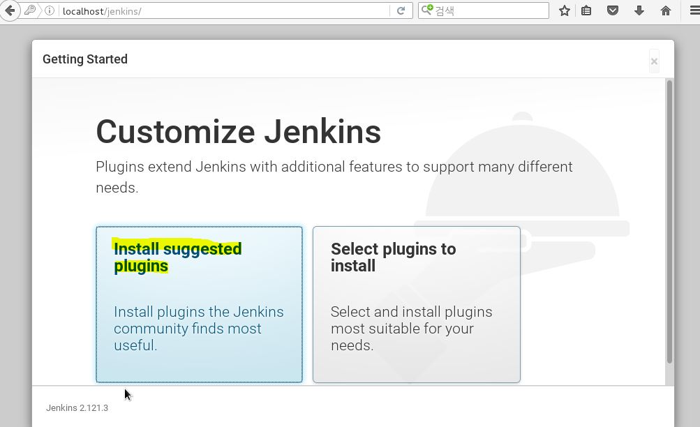
플러그인 설치 단계로 넘어갑니다.

 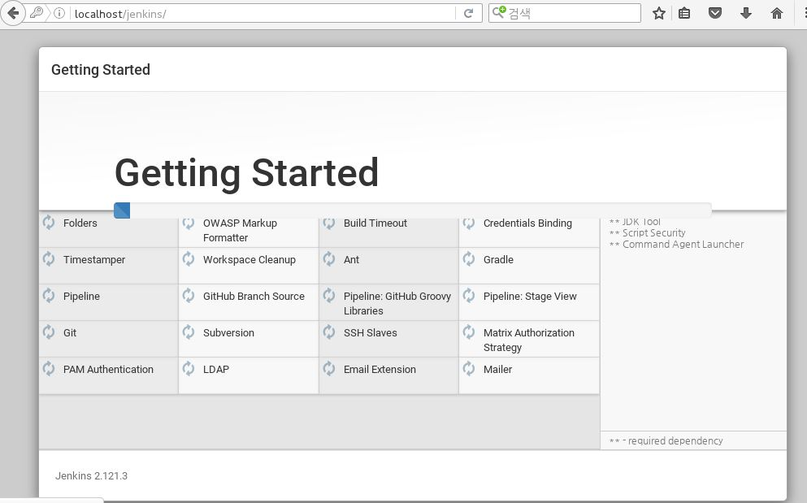
 플러그인 설치 진행중..
 
 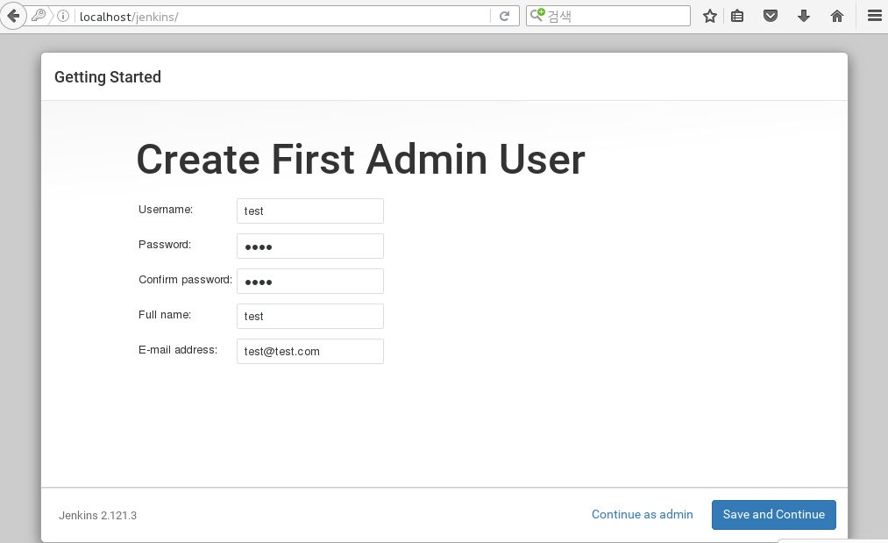
  첫 관리자 계정을 만드는 화면입니다. 폼에 맞게 내용을 적어주어 만들고, 계속 다음 단계로 넘어가 설치를 완료합니다.
 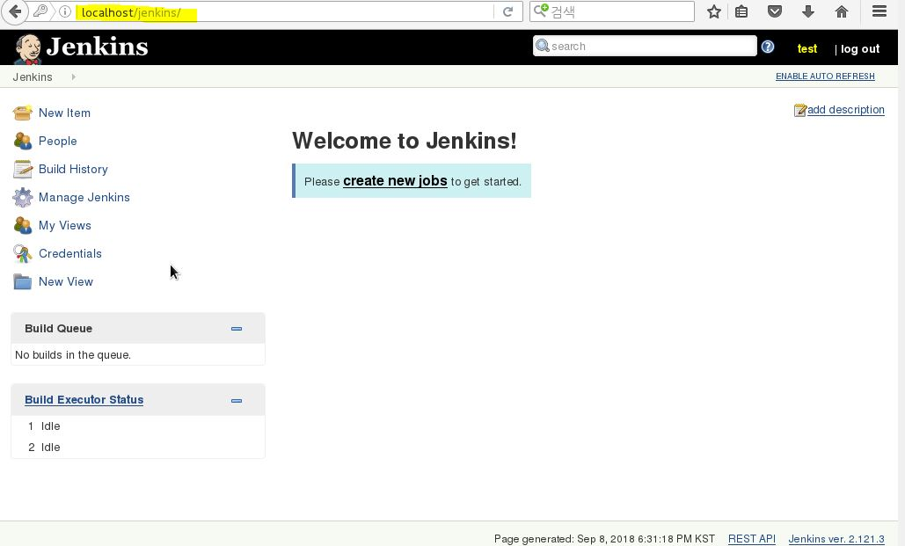
 플러그인 설치 완료 후, 전에 만든 관리자 계정을 통해 로그인 한 후, 정상 작동하는 화면을 볼 수 있습니다.
 
# Redmine 실행
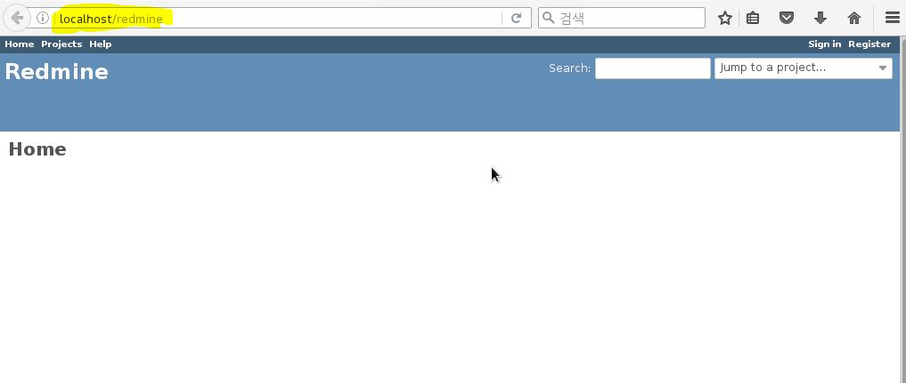
localhost/redmine으로 접속하여 redmine을 사용 가능합니다.

### SVN 계정 설정
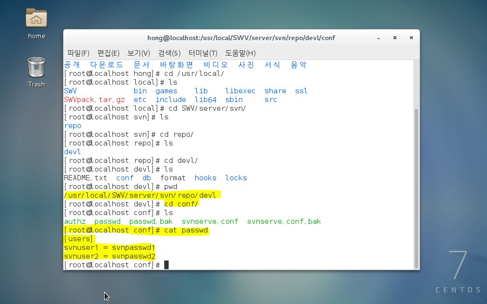

svn 저장소는 `/usr/local/server/svn/repo/devl`에 위치시켰습니다.
svn을 사용하는 계정에 관한 설정은, 권한은 `/usr/local/server/svn/repo/devl/conf/` 폴더 안에 파일들의 내용을 변경하면 됩니다.  
passwd 파일 안에서 사용자의 계정과 비밀번호를 설정합니다.
```
예시)
[users]
ID = passwd
ID2 = passwd2
```


---------------------------------------
# Compile Install
(잠시 명령어만 저장)
```
모든 작업은 root 권한으로 한다.
에디터를 사용하는데 필요하면 :set nu 로 줄 표시를 한다.
netstat -tnlp를 사용하여 포트 개방 작업을 할때 체크용으로 쓴다

yum update -y #업데이트
reboot #재시작하기
cd /usr/local/
mkdir SWV
cd SWV
mkdir dev tools server src toolchain htdocs


================================================================================================================
[openSSL 업데이트] 1.0.1 -> 1.0.2
mkdir /usr/local/SWV/tools/openssl
cd /usr/local/SWV/tools/openssl
wget https://www.openssl.org/source/openssl-1.0.2e.tar.gz # 웹에서 다운로드
tar xvzf openssl-1.0.2e.tar.gz #압축 해제
cd opsenssl-1.0.2e
./config --prefix=/usr --openssldir=/usr/local/SWV/tools/openssl shared #설치진행
make
make install

openssl version #버전 확인

================================================================================================================
[FTP]

yum -y install vsftpd #yum으로 설치

#vsftpd.conf 파일 수정
vim /etc/vsftpd/vsftpd.conf

#anonymous_enable=YES 를 NO로 변경
#chroot_list_enable=YES
#chroot_list_file 경로
#listen=NO 를 YES로 변경
#listen_ipv6=YES 를 NO로 변경

#vim /etc/vsftpd/chroot_list로 chroot_list 파일 생성하기

vim /etc/vsftpd/chroot_list
    root
    계정명
 
#방화벽 설정
firewall-cmd --permanent --add-service=ftp
firewall-cmd --permanent --add-port=21/tcp
firewall-cmd --reload

#Selinux 해제하기 방법1.
vim /etc/selinux/config
#SELINUX=enforcing 을 disabled로 변경

#Selinux 해제하기 방법2.
setenforce 0 


systemctl enable vsftpd #부팅시 실행
systemctl restart vsftpd #서비스 실행
ps -ax | grep vsftpd #구동확인
================================================================================================================
[Java-1.6.0_45]

#기존 jdk 삭제
rpm -qa | grep jdk
확인 후 모두 삭제
yum remove 확인된 jdk 이름
ex) yum remove java-1.6.0-openjdk-1.6.0.0-1.48.1.11.3.el6_2.x86_64

wget --no-cookies --header "Cookie: gpw_e24=xxx; oraclelicense=accept-securebackup-cookie;"    "http://download.oracle.com/otn-pub/java/jdk/6u45-b06/jdk-6u45-linux-x64-rpm.bin"
==> 이 명령어로 불가능. 그냥 웹에서 다운 받음
chmod +x jdk-6u45-linux-x64-rpm.bin #권한설정
./ jdk-6u45-linux-x64-rpm.bin 로 압축해제
/usr/java/ 내에 압축해제 됨, 옮길것. /usr/local/SWV/dev/java/ 로...

vim /etc/profile #환경변수 세팅하기 파일 끝에 추가해준다.

    JAVA_HOME=/usr/local/SWV/dev/java/jdk1.6.0_45
    CLASSPATH=.:$JAVA_HOME/lib/tools.jar
    PATH=$PATH:$JAVA_HOME/bin
    export JAVA_HOME CLASSPATH PATH
source /etc/profile #환경변수 세팅을 적용하기  
java #자바 확인
javac #자바 확인

jdk1.6 설치 완료


[Java-1.8.0_181]

cd /usr/local/SWV/dev  #위치 이동

mkdir java #java 폴더 만들기    
wget --no-cookies --header "Cookie: gpw_e24=xxx; oraclelicense=accept-securebackup-cookie;" "http://download.oracle.com/otn-pub/java/jdk/8u181-b13/96a7b8442fe848ef90c96a2fad6ed6d1/jdk-8u181-linux-x64.rpm" ##자바rpm다운
rpm -ivh --prefix=/usr/local/SWV/dev/java jdk-8u181-linux-x64.rpm #rpm으로 자바 설치하기


vim /etc/profile #환경변수 세팅하기 파일 끝에 추가해준다.

    JAVA_HOME=/usr/local/SWV/dev/java/jdk1.8.0_181
    CLASSPATH=.:$JAVA_HOME/lib/tools.jar
    PATH=$PATH:$JAVA_HOME/bin
    export JAVA_HOME CLASSPATH PATH
source /etc/profile #환경변수 세팅을 적용하기  

#jdk폴더 이름 jdk1.8.0_181인지 다시한번 확인
java #자바 확인
javac #자바 확인
================================================================================================================
[톰캣-7.0.90]
cd /usr/local/SWV/server #위치 이동
wget http://mirror.navercorp.com/apache/tomcat/tomcat-7/v7.0.90/bin/apache-tomcat-7.0.90.tar.gz
tar -xvzf apache-tomcat-7.0.90.tar.gz
ln -s /usr/local/SWV/server/apache-tomcat-7.0.90/ tomcat

vim /etc/profile #환경변수 설정하기 파일 끝에 수정
        JAVA_HOME=/usr/local/SWV/dev/java/jdk1.6.0_45
        JRE_HOME=/usr/local/SWV/dev/java/jdk1.6.0_45
        CATALINA_HOME=/usr/local/SWV/server/tomcat
        CLASSPATH=.:$JAVA_HOME/lib/tools.jar:$CATALINA_HOME/lib/jsp-api.jar:$CATALINA_HOME/lib/servlet-api.jar
        PATH=$PATH:$JAVA_HOME/bin:$CATALINA_HOME/bin
        export JAVA_HOME CLASSPATH PATH CATALINA_HOME JRE_HOME

[톰캣-8.5.30]

cd /usr/local/SWV/server  #위치 이동

wget http://apache.mirror.cdnetworks.com/tomcat/tomcat-8/v8.5.32/bin/apache-tomcat-8.5.32.tar.gz #다운로드 주소가 없다면 http://apache.mirror.cdnetworks.com/tomcat/tomcat-8/ 에서 주소따오면 된다
tar -xvzf apache-tomcat-8.5.32.tar.gz #압축풀기
ln -s /usr/local/SWV/server/apache-tomcat-8.5.32/ tomcat #심볼릭 링크 걸기

vim /etc/profile #환경변수 설정하기 파일 끝에 수정
    JAVA_HOME=/usr/local/SWV/dev/java/jdk1.8.0_181
        JRE_HOME=/usr/local/SWV/dev/java/jdk1.8.0_181
        CATALINA_HOME=/usr/local/SWV/server/tomcat
        CLASSPATH=.:$JAVA_HOME/lib/tools.jar:$CATALINA_HOME/lib/jsp-api.jar:$CATALINA_HOME/lib/servlet-api.jar
        PATH=$PATH:$JAVA_HOME/bin:$CATALINA_HOME/bin
        export JAVA_HOME CLASSPATH PATH CATALINA_HOME JRE_HOME


source /etc/profile #변수 적용시키기
cd tomcat/bin #톰캣의 bin으로 이동
./startup.sh #서비스 실행   or  $./catalina.sh start 
./shutdown.sh #!서비스 종료할때
netstat -anp | grep java #8080 포트(톰캣의 기본 포트)가 열려 있는 것을 확인
#http://localhost:8080 를 통해 톰캣 실행 확인

vim /usr/local/SWV/server/tomcat/conf/server.xml
    #톰캣 기본 디렉토리 변경하기
     <Host name="localhost"  appBase="/usr/local/SWV/htdocs"
            unpackWARs="true" autoDeploy="true"
        xmlValidation="false" xmlNamespaceAware="false">
    <Context path="" docBase="." reloadable="true"/>


firewall-cmd --permanent --zone=public --add-port=8080/tcp #방화벽 8080 포트 해제
firewall-cmd --reload #방화벽 재시작

================================================================================================================
[아파치-2.4.29]
cd /usr/local/SWV/server  #위치 이동
yum -y install gcc make gcc-c++ pcre-devel httpd-devel apr-devel apr-util-devel #gcc 패키지 
wget http://archive.apache.org/dist/httpd/httpd-2.4.29.tar.gz #아파치 다운로드
wget http://mirror.apache-kr.org/apr/apr-1.6.3.tar.gz #다운로드
wget http://mirror.apache-kr.org/apr/apr-util-1.6.1.tar.gz #다운로드
wget http://downloads.sourceforge.net/project/pcre/pcre/8.41/pcre-8.41.tar.gz #다운로드
tar -xvzf httpd-2.4.29.tar.gz #아파치 압축해제
tar -xzvf apr-1.6.3.tar.gz #압축 해제
tar -xzvf apr-util-1.6.1.tar.gz #압축 해제
tar -xzvf pcre-8.41.tar.gz #압축해제

mv apr-1.6.3 ./httpd-2.4.29/srclib/apr
mv apr-util-1.6.1 ./httpd-2.4.29/srclib/apr-util

cd pcre-8.41 #위치 이동
./configure
make
make install
cd ../httpd-2.4.29 #httpd-2.4.29 폴더로 이동
./configure --prefix=/usr/local/SWV/server/httpd #server home 디렉토리 설정
yum -y install expat-devel
make
make install
cd .. #상위 폴더로 나가기
mv httpd/htdocs ../   #htdocs 위치 변경하기
vim httpd/conf/httpd.conf #위에서 htdocs의 위치를 변경했으니 설정파일에서도 경로를 위의 이동한 경로로 설정 (경로는: /usr/local/SWV/htdocs 가 된다)
#server 루트와 document 디렉토리의 경로를 설정해준다.


    DocumentRoot "/usr/local/SWV/htdocs"

    <Directory "/usr/local/SWV/htdocs">

httpd/bin/httpd -k start #아파치 시작
ln -s /usr/local/SWV/server/httpd/bin/httpd /bin/httpd #기존에 걸려있던 링크 제거해야한다.

#http://localhost/ #접속으로 아파치 구동중인 것을 확인
firewall-cmd --permanent --zone=public --add-port=80/tcp #80번포트 방화벽 해제
firewall-cmd --reload #방화벽 재시작
================================================================================================================
[아파치 톰켓 커넥터] 
#톰켓 커넥터 JK를 다운로드한다.
cd /usr/local/SWV/server #위치 이동
wget http://apache.org/dist/tomcat/tomcat-connectors/jk/tomcat-connectors-1.2.42-src.tar.gz  #jk다운로드
tar -xzvf tomcat-connectors-1.2.42-src.tar.gz #압축풀기
ln -s tomcat-connectors-1.2.42-src/ connector  #심볼릭링크달기
cd connector/native  #디렉토리 이동
chmod +x buildconf.sh #권한 설정하기 
./configure --with-apxs=/usr/local/SWV/server/httpd/bin/apxs && make && make install # 컴파일 및 인스톨위한 준비

cp apache-2.0/mod_jk.so /usr/local/SWV/server/httpd/modules/ #mod_jk.so 복사를 해준다

vim /usr/local/SWV/server/httpd/conf/httpd.conf #아파치 설정하기, 다음 내용을 아래에 추가한다.(/를 눌러 검색모드에 진입한다. n은 next임. LoadModule을 찾아 아래에 추가)
    LoadModule jk_module modules/mod_jk.so
<VirtualHost *:80>
ServerName localhost
# 확장자 jsp, json, xml, do를 가진 경로는 woker tomcat으로 연결하는 구문입니다.
JkMount /*.jsp tomcat
JkMount /*.json tomcat
JkMount /*.xml tomcat
JkMount /*.do tomcat
</VirtualHost>

<IfModule mod_jk.c>
# 워커 설정파일 위치
JkWorkersFile conf/workers.properties
# 공유 메모리파일 위치 반드시 Selinux 보안때문에 run에 위치 필수
JkShmFile run/mod_jk.shm   
JkLogFile logs/mod_jk.log   
JkLogLevel info     
JkLogStampFormat "[%y %m %d %H:%M:%S] "
</IfModule>


    
mkdir /usr/local/SWV/server/httpd/run

chcon -u system_u -r object_r -t httpd_modules_t /usr/local/SWV/server/httpd/modules/mod_jk.so     
vim /usr/local/SWV/server/httpd/conf/workers.properties  # mod_jk.conf 파일에서 설정한 워커 설정 파일 만들기
worker.list=tomcat
worker.tomcat.port=8009
worker.tomcat.host=localhost
worker.tomcat.type=ajp13
worker.tomcat.lbfactor=1

    
    
#아파치가 잘 작동이 안되어 에러 로그를 확인해보니 특정 경로와 함께 Unable to start due to shared memory failure. 라는 에러가 나온다. 이는 httpd 폴더 하위에 run이라는 디렉토리를 생성하여 해결했다.
#http://localhost 로 접속했을때 톰캣 화면이 나오면 연동이 된 것이다 (참고: 권한은 755 )
#아파치 재시작 !
================================================================================================================
[php-7]

cd /usr/local/SWV/server #경로 이동하기
yum -y install libxml2 libxml2-devel enchant-devel libjpeg-devel libpng-devel libXpm-devel freetype-devel.x86_64 libc-client-devel libmcrypt epel-release php-mcrypt libmcrypt-devel unixODBC-devel libtidy libtidy-devel libxslt-devel curl-devel systemd-devel openldap-devel sqlite-devel
yum install gcc.x86_64 gcc-c++.x86_64 wget.x86_64 bzip2-devel.x86_64 pkgconfig.x86_64 openssl-devel.x86_64 make.x86_64 man.x86_64 nasm.x86_64 gmp.x86_64 gmp-devel.x86_64 curl-devel.x86_64 libicu-devel.x86_64 libsodium-devel.x86_64\
gdbm-devel.x86_64 readline-devel.x86_64 compat-readline43.x86_64 ncurses-devel.x86_64 db4-devel.x86_64 automake* autoconf* -y #php 설치를 위한 의존성 패키지 설치하기
wget http://www.php.net/distributions/php-7.0.4.tar.gz #php 다운로드
tar -xzvf php-7.0.4.tar.gz #압축 해제하기
cd php-7.0.4 #폴더로 이동

cp -frp /usr/lib64/libldap* /usr/lib/

./configure --build=x86_64-redhat-linux-gnu --host=x86_64-redhat-linux-gnu --prefix=/usr/local/SWV/server/php --exec-prefix=/usr/local/SWV/server/php --libdir=/usr/local/SWV/server/php/lib64\
--with-libdir=lib64 --with-bz2=shared --with-zlib=shared --enable-zip=shared --enable-soap=shared --enable-intl=shared --with-mcrypt=shared --with-openssl=shared --with-readline --with-curl=shared,/opt/curl-7.49.1\
--enable-ftp=shared --enable-mysqlnd=shared --with-mysqli=shared,mysqlnd --with-mysql-sock=/var/lib/mysql/mysql.sock --with-pdo-mysql=shared,mysqlnd --with-sqlite3=shared --with-pdo-sqlite=shared\
--with-imap-ssl --enable-sockets=shared --enable-pcntl=shared --with-enchant=shared --with-unixODBC=shared,/usr --with-gettext=shared --enable-ctype=shared --with-gd=shared --enable-exif=shared --with-xpm-dir=shared\
--with-jpeg-dir=shared --with-png-dir=shared --with-freetype-dir=shared --with-iconv=shared --with-xsl=shared --enable-bcmath=shared --enable-mbstring=shared --enable-simplexml=shared --enable-json=shared\
--enable-tokenizer=shared --with-tidy=shared --enable-dom=shared --enable-phar=shared --enable-hash --enable-session --enable-xml=shared --enable-wddx=shared --enable-opcache=shared --enable-calendar=shared\
--with-pdo-odbc=shared,unixODBC,/usr --enable-fileinfo=shared --with-pcre-regex --enable-gd-native-ttf --with-ldap=shared --with-ldap-sasl --with-kerberos --with-mhash=shared --enable-shmop=shared --enable-pdo=shared\
--enable-dba=shared --enable-posix=shared --with-xmlrpc=shared --enable-xmlreader=shared --enable-xmlwriter=shared --with-layout=GNU --with-config-file-path=/usr/local/SWV/server/php/etc\
--with-config-file-scan-dir=/usr/local/SWV/server/php/etc/php.d --enable-fpm --enable-cli --disable-rpath --enable-cgi --disable-static --with-fpm-user=nginx --with-fpm-group=nginx imap=shared\
--with-apxs2=/usr/local/SWV/server/httpd/bin/apxs --with-iconv -enable-fpm


에러나면
yum -y install epel-release
yum -y install php-mcrypt
yum -y install libmcrypt-devel
yum install libtidy libtidy-devel
하고 다시 설치

make -j4
make install
# make 시 에러 발생하면 (Bug #62023 [sapi/cli/php] Error 1)  $make clean 후 다시 make를 통해 진행한다.

cp php.ini-production /usr/local/SWV/server/php/etc/php.ini #설정파일 복사하기

mkdir -p /usr/local/SWV/server/php/etc/php.d/
vim /usr/local/SWV/server/php/etc/php.d/extensions.ini #아래 내용 넣기
    extension=bz2.so
    extension=calendar.so
    extension=ctype.so
    extension=curl.so
    extension=dom.so
    extension=enchant.so
    extension=exif.so
    extension=fileinfo.so
    extension=ftp.so
    extension=gd.so
    extension=gettext.so
    #extension=iconv.so
    extension=imap.so
    extension=json.so
    extension=ldap.so
    extension=mbstring.so
    extension=mcrypt.so
    extension=mysqlnd.so
    extension=mysqli.so
    zend_extension=opcache.so
    extension=openssl.so
    extension=pdo.so
    extension=pdo_mysql.so
    #extension=pdo_sqlite.so
    extension=phar.so
    extension=posix.so
    extension=shmop.so
    extension=simplexml.so
    extension=soap.so
    extension=sockets.so
    #extension=sqlite.so
    extension=tokenizer.so
    extension=xml.so
    extension=wddx.so
    extension=xmlreader.so
    extension=xmlrpc.so
    extension=xmlwriter.so
    extension=xsl.so
    extension=zip.so
    extension=zlib.so
    
cd /usr/local/SWV/server/php/etc

cp php-fpm.conf.default php-fpm.conf #fpm설정파일 복사하기
================================================================================================================
[젠킨스-2.89.4]
cd /usr/local/SWV/htdocs  #경로 이동
wget http://mirrors.jenkins.io/war-stable/latest/jenkins.war #젠킨스 war 다운로드 war파일을 톰캣에서 

#아파치의 설정파일에 삽입하기
vim /usr/local/SWV/server/httpd/conf/httpd.conf
    #<VirtualHost *:80>
           #  ServerName localhost
           #  JkMount /*.jsp tomcat
           #  JkMount /*.json tomcat
           #  JkMount /*.xml tomcat
           #  JkMount /*.do tomcat 
       # 이 밑에 아래 내용을 추가 한다.

ProxyPass /jenkins http://127.0.0.1:8080/jenkins
ProxyPassReverse /jenkins http://127.0.0.1:8080/jenkins

#아래에 맞는 proxy 모듈을 사용하도록 되어있는지 확인한다 (주석해제한다)
vim /usr/local/SWV/server/httpd/conf/httpd.conf    
    LoadModule proxy_module modules/mod_proxy.so
    LoadModule proxy_connect_module modules/mod_proxy_connect.so
    LoadModule proxy_http_module modules/mod_proxy_http.so
    LoadModule proxy_ajp_module modules/mod_proxy_ajp.so


#톰캣을 재부팅하고 http://localhost/jenkins로 접속
#웹페이지에 나오는 /root/.jenkins/secrets/initialAdminPassword에 unlock에 필요한 암호가 들어있다

cat /root/.jenkins/secrets/initialAdminPassword #암호 복사하여 웹페이지에 넣기

#암호를 넣게 되면 젠킨스를 커스터마이즈를 할 수 있는 페이지로 넘어간다. 
#필요한 것들을 설치하면 Admin 유저를 생성하는 페이지로 넘어간다.
# 참고:에러상황(13)Permission denied: AH00957: HTTP: attempt to connect to 127.0.0.1:8080 (localhost) failed 같은 에러가 발생하면
setsebool -P httpd_can_network_connect on
================================================================================================================
[MySQL-5.7.23?]
기존 MySQL 삭제
# rpm -qa | grep mysql
mysql-community-release-el7-5.noarch
mysql-community-common-5.x.35-2.el7.x86_64
mysql-community-libs-5.x.35-2.el7.x86_64

# rpm -e --nodeps mysql-community-release-el7-5.noarch
# rpm -e --nodeps mysql-community-common-5.x.35-2.el7.x86_64
# rpm -e --nodeps mysql-community-libs-5.x.35-2.el7.x86_64

yum remove mysql-server

MySQL 설치
#https://dev.mysql.com/get/Downloads/MySQL-5.7/mysql-5.7.23.tar.gz


# wget http://dev.mysql.com/get/mysql57-community-release-el7-7.noarch.rpm ## 안씀 위에꺼 씀

# yum localinstall mysql57-community-release-el7-7.noarch.rpm

# yum install mysql-server

서비스 시작 및 부팅 시 자동 시작 설정
service mysqld start
chkconfig --add mysqld
chkconfig --level 35 mysqld on

비밀번호 확인
#sudo grep 'temporary password' /var/log/mysqld.log

CREATE DATABASE redmine CHARACTER SET utf8 COLLATE utf8_general_ci;  #레드마인와 연동할 디비 생성
CREATE USER 'redmine'@'localhost'IDENTIFIED BY ㅡ'비밀번호'; #레드마인 디비의 유저와 비번 생성
GRANT ALL PRIVILEGES ON redmine.* TO 'redmine'@'%'; #redmine에게 권한 부여
FLUSH PRIVILEGES; #설정 적용

[MariaDB-10.2.14]
cd /usr/local/SWV/tools #경로 이동
yum -y install cmake #설치를 위한 cmake 설치하기
wget https://downloads.mariadb.org/interstitial/mariadb-10.2.14/source/mariadb-10.2.14.tar.gz #마리아 디비 다운로드

tar -xzvf mariadb-10.2.14.tar.gz
cd mariadb-10.2.14/
useradd mysql
mkdir /usr/local/SWV/tools/mysql
mkdir /home/mysql/data

cd /usr/local/SWV/tools/mariadb-10.2.14/
vim CMakeLists.txt
    /mysql-test 를 포함하는 줄을 지우고 저장한다    rpm
cmake \
-DCMAKE_INSTALL_PREFIX=/usr/local/SWV/server/mysql \
-DWITH_EXTRA_CHARSETS=all \
-DMYSQL_DATADIR=/home/mysql/data \
-DENABLED_LOCAL_INFILE=1 \
-DDOWNLOAD_BOOST=1 \
-DWITH_BOOST=../boost_1_59_0 \
-DWITH_INNOBASE_STORAGE_ENGINE=1 \
-DWITH_PARTITION_STORAGE_ENGINE=1 \
-DWITH_FEDERATED_STORAGE_ENGINE=1 \
-DWITH_BLACKHOLE_STORAGE_ENGINE=1 \
-DWITH_MYISAM_STORAGE_ENGINE=1 \
-DENABLED_LOCAL_INFILE=1 \
-DMYSQL_UNIX_ADDR=/tmp/mysql.sock \
-DSYSCONFDIR=/etc \
-DDEFAULT_CHARSET=utf8 \
-DDEFAULT_COLLATION=utf8_general_ci \
-DWITH_EXTRA_CHARSETS=all

make
make install


#설치 완료 후
cd /usr/local/SWV/tools/mysql
chown -R mysql. /usr/local/SWV/tools/mysql
./scripts/mysql_install_db --user=mysql --datadir=/home/mysql/data
cp support-files/my-huge.cnf /etc/my.cnf
cp support-files/mysql.server /etc/init.d/mysqld
ln -s /usr/local/SWV/tools/mysql/bin/mysql /bin/mysql
#서비스 시작 및 부팅시 자동 시작설정하기
service mysqld start
chkconfig --add mysqld
chkconfig --level 35 mysqld on

# 비밀번호 변경
bin/mysqladmin -uroot password '비밀번호'

#mysql 환경변수 추가
vim /etc/profile
#mysql home 과 path를 수정해준다, 아래는 수정후 전체 내용이다
        JAVA_HOME=/usr/local/SWV/dev/java/jdk1.8.0_181
        JRE_HOME=/usr/local/SWV/dev/java/jdk1.8.0_181
        CATALINA_HOME=/usr/local/SWV/server/tomcat
        CLASSPATH=.:$JAVA_HOME/lib/tools.jar:$CATALINA_HOME/lib/jsp-api.jar:$CATALINA_HOME/lib/servlet-api.jar
        PATH=$PATH:$JAVA_HOME/bin:$CATALINA_HOME/bin:$MYSQL_HOME/bin
        MYSQL_HOME=/usr/local/SWV/tools/mysql
        export JAVA_HOME CLASSPATH PATH CATALINA_HOME JRE_HOME MYSQL_HOME


source /etc/profile
#접속후 
mysql -u root -p

CREATE DATABASE redmine CHARACTER SET utf8 COLLATE utf8_general_ci;  #레드마인와 연동할 디비 생성
CREATE USER 'redmine'@'localhost'IDENTIFIED BY ㅡ'비밀번호'; #레드마인 디비의 유저와 비번 생성
GRANT ALL PRIVILEGES ON redmine.* TO 'redmine'@'%'; #redmine에게 권한 부여
FLUSH PRIVILEGES; #설정 적용
UPDATE INTO user SET Host='%' WHERE user='redmine'


================================================================================================================
[레드마인-3.4.4]
#레드마인 의존 라이브러리 설치하기
cd /usr/local/SWV/dev/ #경로 이동

yum -y install gcc g++ cpp gcc-c++ 
yum -y install openssl-devel readline-devel zlib-devel curl-devel libyaml-devel
yum -y install mysql-devel ImageMagick ImageMagick-devel

#Ruby 설치하기 레드마인은 루비로 되어 있으므로 설치한다. 


wget http://cache.ruby-lang.org/pub/ruby/ruby-2.5.0.tar.gz #루비 압축파일 다운로드  ! 2.2.2 이상의 버젼을 써야한다.
tar -zxvf ruby-2.5.0.tar.gz #압축풀기
cd ruby-2.5.0 #경로이동

./configure --prefix=/usr/local/SWV/dev/ruby --disable-install-doc
make && make install #컴파일 진행하기
ln -s /usr/local/SWV/dev/ruby-2.5.0/ruby /usr/bin/ruby 
ruby -v #루비 버젼 확인하기


cd /usr/local/SWV/dev/ #경로 이동
wget https://rubygems.org/rubygems/rubygems-2.7.6.tgz #루비잼 다운로드
tar -zxvf rubygems-2.7.6.tgz #루비잼 압축풀기

cd rubygems-2.7.6 #rubygems로 이동
ruby setup.rb #rubygems 설치하기
bin/gem install rails -V #레일 설치
bin/gem install bundler -no-rdoc --no-ri #gem으로 번들러 설치

cd /usr/local/SWV/tools #경로 이동
wget http://www.redmine.org/releases/redmine-3.4.4.tar.gz #레드마인 압축파일 다운로드
tar -xzvf redmine-3.4.4.tar.gz #압축해제

mv redmine-3.4.4 redmine #압축해제된 레드마인폴더 이름 바꾸기
cd redmine #경로 이동
cp ./config/database.yml.example config/database.yml #설정파일 구성하기
vim ./config/database.yml #DB, 계정 설정하기 production만  
cd bin
yum install libxslt-devel libxml2-devel
bundle config build.nokogiri --use-system-libraries
./bundle install --without development test  #패키지를 설치함

./bundle exec rake generate_secret_token #세션변조 방지 Key 생성하기.
./bundle exec rake db:migrate RAILS_ENV=production # 디비 스키마 설정
./bundle exec rake redmine:load_default_data RAILS_ENV=production REDMINE_LANG=ko  #언어:한국어 설정하기
================================================================================================================
#[레드마인+아파치 연동 모듈 설치하기]
cd /usr/local/SWV/dev/rubygems-2.7.6/ #루비잼으로 이동

bin/gem install passenger  #연동 모듈 설치하기
/usr/local/SWV/dev/ruby/lib/ruby/gems/2.5.0/gems/passenger-5.3.4/bin/passenger-install-apache2-module #설치후 이 명령어로 설치를 진행할 수 있다.
    enter입력
    느낌표 입력후 루비로 설정해주고 enter

    #red_apache3사진을 보면 설정파일에 코드를 추가하라고 하는 것을 볼 수 있다.
      LoadModule passenger_module /usr/local/SWV/dev/ruby/lib/ruby/gems/2.5.0/gems/passenger-5.3.4/buildout/apache2/mod_passenger.so
   <IfModule mod_passenger.c>
     PassengerRoot /usr/local/SWV/dev/ruby/lib/ruby/gems/2.5.0/gems/passenger-5.3.4
     PassengerDefaultRuby /usr/local/SWV/dev/ruby/bin/ruby
   </IfModule>


#redmine/public을 웹서비스 폴더에서 사용 가능하도록 링킹을 걸고, apache 권한을 줘야한다.
ln -s /usr/local/SWV/tools/redmine/public /usr/local/SWV/htdocs/redmine
chown -R apache. /usr/local/SWV/htdocs/redmine


vim /usr/local/SWV/server/httpd/conf/httpd.conf                #위에서 복사해 놓은 코드를 추가한다

    (맨아래에 추가)
    LoadModule passenger_module /usr/local/SWV/dev/ruby/lib/ruby/gems/2.5.0/gems/passenger-5.2.3/buildout/apache2/mod_passenger.so
   <IfModule mod_passenger.c>
     PassengerRoot /usr/local/SWV/dev/ruby/lib/ruby/gems/2.5.0/gems/passenger-5.3.4
     PassengerDefaultRuby /usr/local/SWV/dev/ruby/bin/ruby
   </IfModule>


    <Directory "/usr/local/SWV/htdocs/redmine">
        Require all granted
        Options FollowSymLinks
        AllowOverride None
        RailsBaseURI /redmine

    </Directory>

    
systemctl restart httpd #웹서비스 재시작하기
http://localhost/redmineweb 에 접속하여 레드마인을 확인한다.
초기 ID/PW는 admin/admin이다
================================================================================================================
[Subversion- 1.7.14]
cd /usr/local/ #경로 이동
yum -y install subversion #Subversion 설치하기

mkdir svn #svn 폴더만들기
cd svn # svn폴더로 이동
mkdir repo #저장소로 사용할 폴더 만들기
cd repo #생성한 저장소로 이동하기 
svnadmin create --fs-type fsfs devl   #devl은 저장소명이다 이렇게 하면 devl이라는 저장소가 생긴다

#설정 파일 생성하기 service 명령어로 svn을 서비스 시작/종료를 가능하게 한다
#이전에 만든 저장소의 상위폴더의 위치를 적어 파일 생성한다(devl 저장소의 상위 폴더는 /usr/local/svn/repo)
echo 'OPTION="--threads --root /usr/local/svn/repo"' > /etc/sysconfig/svnserve
cat /etc/sysconfig/svnserve #파일의 내용을 확인해본다

cd devl/conf #위치 이동, devl 폴더안의 svnserve.conf 파일을 수정할 것이다.
mv svnserve.conf svnserve.conf.bak #수정하기 전에 파일을 미리 백업하기
echo '[general]
    anon-access = none
    auth-access = write
    password-db = passwd
    authz-db = authz' > svnserve.conf

cat svnserve.conf #잘 수정했는지 확인하기


#계정설정하기
mv passwd passwd.bak
echo '[users]
    svnuser1 = svnpasswd1

    svnuser2 = svnpasswd2' > passwd
cat passwd #잘 작성했는지 확인하기

#권한관련 에러는 conf/authz 파일의 아래에 계정 권한을 추가하면 된다.


service svnserve start #서비스 시작하기,   systemctl start svnserve로도 가능
ps -ef | grep svnserve | grep -v grep #svn 이 돌아가는 것을 볼 수 있다
netstat -anp | grep svnserve #svn 서버가 돌아가는데 기본포트는 3690이다, 실행 되는 것을 볼 수 있다
systemctl enable svnserve #재부팅시 자동 시작하게 설정

================================================================================================================
[SourceNavigator]

cd /usr/local/SWV/dev
mkdir SNavi
cd SNavi

wget https://sourceforge.net/projects/sourcenav/files/NG4.5/sourcenavigator-NG4.5.tar.bz2

tar jxf sourcenavigator-NG4.5.tar.bz2


================================================================================================================
[Graphviz]
 
cd ../
mkdir graphviz
cd graphviz

wget -c http://graphviz.gitlab.io/pub/graphviz/stable/SOURCES/graphviz.tar.gz \ -O graphviz-2.40.1.tar.gz

tar -xzvf graphviz-2.40.1.tar.gz


```

