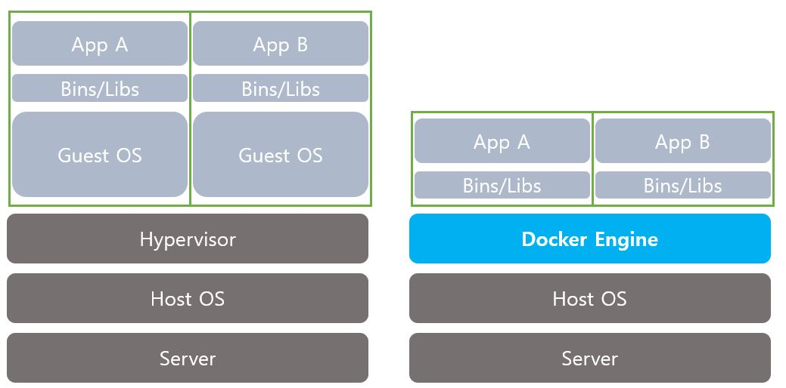

# Docker

## Virtual Machine, Docker 구조

도커는 **개발-테스트-운영서비스**를 하나로 통일하여 효율적으로 관리가 가능!  
쉽게, **Docker** 가 가상머신보다 더욱 가볍다고 볼 수 있다.


가상머신은 OS에 올려지고 하드웨어가 그대로 가상화 된 것이다. 즉, 메모리나 CPU 등의 성능에 제한적인 단점이 있어 손실이 발생한다.
반면에, Docker는 Docker Engine 위에 어플리케이션이 올라가 Host OS 위에서 도커 컨테이너가 생성되는 것이다. 커널을 그대로 사용하고 **기존의 OS와 프로세스 영역을 그대로 사용하기 때문에 메모리 접근 등의 속도가 가상 머신보다 빠르다.**

## Install (Binaries)  
리눅스에 설치로 *yum* 이나 *apt-get* 으로 다운하는 법도 있지만, 파일로 설치할때는 아래와 같이 한다.
다운로드 링크: (https://download.docker.com/linux/static/stable/x86_64/)
바이너리 파일을 다운로드 한다.
```sh
tar zxvf /path/to/<FILE>.tar.gz #파일 압축풀기
sudo cp docker/* /usr/bin/ #docker 명령어 실행 가능하도록 추가

sudo dockerd & #docker 데몬 시작
```


### 도커 명령어
`-d 백그라운드 실행`
`-p 호스트와 컨테이너의 포트를 연결 (포트 포워딩)`
`-v 호스트와 컨테이너의 디렉토리 연결 (마운트)`
`-e 컨테이너 내에서 사용할 환경변수 설정`
`-name 컨테이너 이름 설정`
`-rm 프로세스 종료시 컨테이너 자동 삭제`
`-it -i와 -t를 동시에 사용한 것ㄷ으로 터미널 입력을 위한 옵션`
`-link 컨테이너 연결 [컨테이너명:별칭]`
